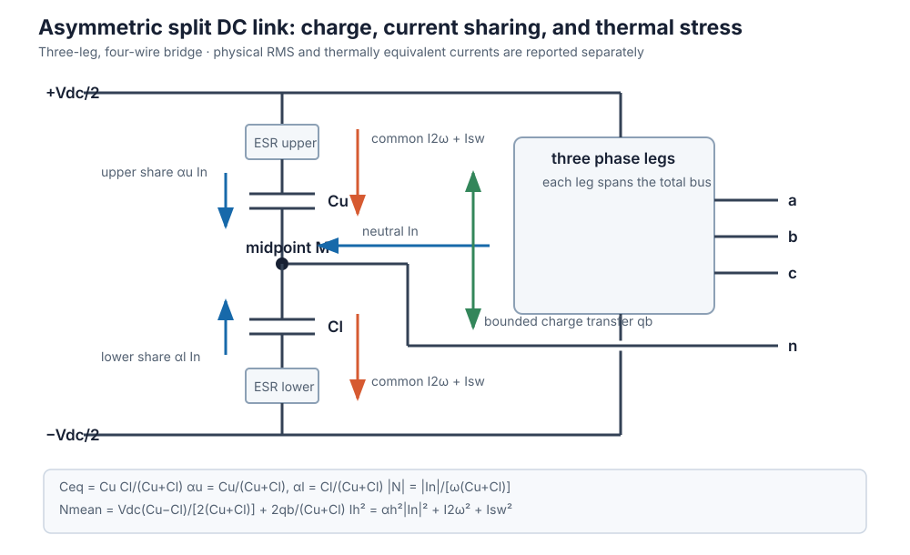

# Advanced inverter

> **Kind:** Component model · **Maturity:** experimental · **Direction:** forward · **Temporal:** single-snapshot

[`AdvancedInverter`](@ref) is a more detailed inverter-based-resource (IBR) than
the BMOPFTools engine's built-in current-injection IBR. The engine models an IBR
as a bounded current source at the point of connection (POC); this model adds
the core structural idea from the BMOPFTools
[IBR model extensions design doc](https://github.com/frederikgeth/BMOPFTools.jl/blob/main/docs/ibr_model_extensions.md)
— an explicit **internal AC node** behind the converter — and the circuit and
DC-link constraints layered on it. See the dedicated [IBR chapter](@ref
ibr-scientific-foundations) for the first-principles derivation and the
[maintained bibliography](@ref ibr-references).

```text
converter internal node -- Zc -- filter midpoint -- Zg -- POC bus
                                  |
                               Rd + Cf
                                  |
                               neutral
```

The midpoint and grid-side arm are optional. Without them the circuit reduces
exactly to the original internal node behind one series primitive.

On top of that structure it carries sampled three-phase **feasible-region models**
— 3-leg (3-wire), 4-leg, and 3-leg split-DC-link converters — whose
DC-utilisation limit is an outer approximation of the continuous-time switching
polytope, coupled to a first-order 2ω bus-ripple derating and neutral-current
limits (see
[Three-phase topology models](@ref three-phase-topology-models) below).

It is built entirely on the BMOPFTools staged API through a `model_hook!`; it
does **not** modify the engine. Device parameters are SI; the solve runs in SI
(`per_unit=false`) or per-unit (`per_unit=true`), scaling every parameter to model
units via `opf_bases(ctx)` — the DC-side quantities (`v_dc`, `c_dc`, `In_max`) stay SI
and the AC↔DC coupling scales through the POC bus's `v_base`/`i_base`/`s_base`.
Results are returned in SI in both modes.

## The five phases

| Phase | Feature | Model |
|---|---|---|
| 0 | Output filter | reduced one-arm primitive, or explicit LCL with independent converter/grid primitive matrices, damped midpoint capacitor, distinct arm currents, and an optional POC shunt |
| 1 | Internal EMF / DC utilisation | `|V_int|` box; a legacy scalar `:SINGLE_PHASE` cap using the documented `/√3` convention; or a three-phase topology's sampled switching polytope (below) |
| 2 | Grid-forming | balanced 120° internal EMF with a bounded magnitude decision variable; no droop, virtual impedance, or limiter dynamics |
| 3 | Converter losses | non-branching `P_dc = P_ac + P_loss`; fitted per-leg fixed/linear/quadratic terms include the fourth-leg neutral current for `:FOUR_LEG` |
| 4 | Double-frequency ripple | single-phase ripple-amplitude cap; three-phase topologies form a small-ripple 2ω bus-voltage phasor that derates the sampled DC rails (below) |

`p_poc` and `q_poc` are the total grid-side exchange. In particular, `q_poc`
and `q_set` include the optional grid-side shunt; `q_conv` is the converter-side
quantity before the filter and shunt.

Every feature is opt-in: with only `id`, `bus`, and `s_max` the device is a plain
grid-following converter, and the internal node collapses onto the POC when the
filter is zero.

!!! warning "`:SINGLE_PHASE` is not yet a circuit topology model"
    `modulation_max*v_dc/√3` is a retained scalar convention, not a derived
    full-bridge or half-bridge switching hull. A single-phase full bridge and
    half bridge have different DC-utilisation factors, so do not infer hardware
    feasibility from this cap until the bridge and modulation convention are
    made explicit. Also, for one sinusoidal phase `|V I| = |S|`; consequently
    `p_ripple_max` is only an oscillating-power amplitude bound and largely
    duplicates an apparent-power cap. It does not calculate capacitor voltage or
    RMS current without `v_dc`, `c_dc`, and a DC-source model.

## Key modelling choices (from the design doc)

- **Limits on the converter side.** The total apparent-power circle `s_max` and
  optional per-phase current limit `i_max` are applied on converter quantities
  (internal-node voltage × current), so an output filter reduces the power
  delivered at the POC. Under unbalance, `s_max` alone is not a semiconductor
  thermal limit: supply `i_max`, and `In_max` for the fourth leg, from hardware
  ratings. In explicit LCL mode, `i_grid_max` separately protects the grid-side
  arm because midpoint capacitor current makes `i_mag != i_grid_mag`.
- **Non-branching losses.** With AC power positive = injected to grid and DC power
  positive = drawn from the DC source, the single equation `P_dc = P_ac + P_loss`
  (`P_loss ≥ 0`) holds for both discharge and charge — no direction `if`-branch.
- **Grid-forming ≠ slack.** A grid-forming inverter holds a balanced, bounded
  internal EMF *behind the filter*, but does not replace the network's reference;
  the surrounding grid still needs a slack source.

## Reduced series filter versus explicit LCL

The original `r_filter`/`x_filter` parameters now describe the converter-side
arm. The reduced model remains active when every grid-side parameter and
`c_filter_mid` are zero. Supplying a grid-side arm or midpoint capacitance
creates the explicit circuit:

```julia
lcl = AdvancedInverter(
    id = "inv",
    bus = "poc",
    s_max = 5_000.0,
    r_filter = 0.05,
    x_filter = 0.10,
    r_filter_grid = 0.05,
    x_filter_grid = 0.10,
    c_filter_mid = 20e-6,
    r_filter_damping = 1.0,
    i_max = 25.0,
    i_grid_max = 25.0,
)
```

Each series arm may instead use its own primitive matrices, with conductor order
`phase_terminals` followed by `neutral`. The capacitor is a per-phase
phase-to-neutral branch and `r_filter_damping` is in series with it. Inspect
`v_filter_mag`, `i_mag`, `i_grid_mag`, `i_filter_shunt_mag`,
`p_filter_loss`, and `filter_resonance_hz` together.

`filter_resonance_hz` is the undamped scalar estimate derived from the two
positive arm reactances and `c_filter_mid`. It returns `NaN` for matrix-valued
filters because those require modal analysis. The optimisation still evaluates
only the specified fundamental `f`; it does not solve a frequency sweep or
establish closed-loop stability.

## Worked example

```julia
using PowerOptLab
using BMOPFTools: parse_bmopf

# A stiff grid: slack at "grid", short line to the inverter POC.
net = parse_bmopf("""
{"bus":{
    "grid":{"terminal_names":["1","n"],"perfectly_grounded_terminals":["n"]},
    "poc": {"terminal_names":["1","n"],"perfectly_grounded_terminals":["n"],"v_min":[200.0],"v_max":[250.0]}},
 "voltage_source":{"vs":{"bus":"grid","terminal_map":["1"],"v_magnitude":[230.0],"v_angle":[0.0]}},
 "linecode":{"lc":{"R_series_1_1":0.05}},
 "line":{"l1":{"bus_from":"grid","bus_to":"poc","terminal_map_from":["1"],"terminal_map_to":["1"],"linecode":"lc","length":1.0}}}
"""; from_string=true)

# A converter with an output filter and a three-term loss curve; minimise loss
# while delivering 3 kW to the grid.
inv = AdvancedInverter(id="inv", bus="poc", s_max=5000.0,
                       r_filter=0.2, x_filter=0.5,
                       p_loss_fixed=20.0, a_loss=0.3, c_loss=0.02)

r = solve_advanced_inverter(net, inv; objective=:min_loss, p_set=3000.0)

r.p_poc     # ≈ 3000 W delivered at the POC
r.q_poc     # total POC reactive exchange, including any grid-side shunt
r.p_conv    # converter-side active power (> p_poc: filter losses)
r.p_loss    # 20 + 0.3·|I| + 0.02·|I|²
r.p_cap_loss # optional frequency-weighted capacitor ESR loss
r.p_dc      # = p_conv + p_loss + p_cap_loss (non-branching DC-link balance)
r.v_int_mag # internal EMF magnitude per phase (V)
r.p_filter_loss # passive filter/damping loss between converter and POC (W)
```

Switch `objective=:max_export` to maximise POC active power and watch the
converter rating, filter, EMF/modulation, or ripple limits bind. For a
three-phase `grid_forming=true` inverter the solved internal EMF magnitudes are
equal across phases (balanced 120°) and the 2ω ripple is ≈ 0.

### Choosing a three-phase topology

Set `topology` to one of `:THREE_LEG`, `:FOUR_LEG`, or `:SPLIT_DC` (with `v_dc`,
`c_dc`, and an appropriate neutral limit for the 4-wire ones) to use the sampled
switching-polytope model:

```julia
inv = AdvancedInverter(id="inv", bus="poc", phase_terminals=["a","b","c"], neutral="n",
                       topology=:FOUR_LEG, s_max=20e3, i_max=40.0,
                       v_dc=700.0, c_dc=1.1e-3, In_max=40.0, m_max=0.96,
                       r_filter=0.05, x_filter=0.15)
r = solve_advanced_inverter(net3, inv)   # net3 = a three-phase grid
r.i_neutral   # neutral current (A) — non-zero only under unbalance
r.i_zero      # zero-sequence current (A); i_neutral ≈ 3*i_zero
r.i_negative  # negative-sequence current (A)
r.dv2         # 2ω bus-ripple amplitude (V) that derated the DC rails
r.dv_mid      # split-link midpoint ripple RMS (V; zero for this 4-leg example)
r.i_cap       # physical capacitor RMS ripple current (A)
r.i_cap_thermal # thermally weighted current (A) — compare against the rating
```

On a balanced grid, away from a modulation boundary, all three can produce the
same fundamental operating point (no neutral current and no 2ω ripple). Under
unbalance the 4-leg and split-DC draw neutral current (bounded by `In_max` and/or
the split-link capacitor budget),
and the split-DC needs a **higher `v_dc`** for the same per-phase voltage — the
half-bus utilisation penalty of the split-capacitor structure.

See the API reference for [`AdvancedInverter`](@ref),
[`solve_advanced_inverter`](@ref), and [`InverterResult`](@ref).

## Scope

This is an **experimental** circuit-aware model, not a vendor-validated engine
feature. It
implements the design doc's Phases 0–4 plus the three-phase topology models as a
hook-stamped device; reactive/active priority state machines,
grid-forming-as-reference capability, and dynamic control/fault models are not
included. If a piece of this matures, it can be folded back into the engine.

The model is a fundamental-frequency steady-state capability model with derived
line-frequency midpoint and double-line-frequency DC-link quantities. It is not
a harmonic power flow, switching model, averaged dynamic model, impedance scan,
or EMT model.

### Literature map and fidelity boundary

| Source result | Mapping in `AdvancedInverter` | Important boundary |
|---|---|---|
| Heidari and Geth, [improved algebraic inverter modelling](https://doi.org/10.1016/j.epsr.2024.110825), Eqs. (2)–(20), (36)–(37) | internal voltage, primitive four-conductor filter KVL, POC/internal power, 3-leg zero-sequence restriction, sequence-current limits, and balanced GFM voltage | the extension adds a passive LCL midpoint, but not controller dynamics or a modal impedance scan |
| Same paper, Tables 1–3 | topology and GFM/GFL concepts | Volt-var/Watt, droop, power sharing, constant-PF, and sequence-current controls are not part of this advanced device |
| Deakin, Heidari, and Deng, [DC-link ripple in OPF](https://arxiv.org/abs/2512.18293), Eqs. (5), (11), and (18) | unconjugated `S̃ = Σ U_x I_x`, bus-ripple phasor, and capacitor-current conversion | assumes fundamental sinusoidal phasors, a stiff mean `V_dc`, small ripple, and a DC source that contributes negligibly at 2ω |
| Deakin et al., [capacitor ripple constraints](https://arxiv.org/abs/2606.21934), Eqs. (4)–(9) | simultaneous allocation of midpoint neutral current, 2ω current, and `i_sw`, generalized here to unequal half-banks and ESR-ratio weights | the paper's hybrid **4-leg plus split-link** return path and reconfigurable leg allocation are not represented |
| Liang et al., [split-link voltage utilisation](https://doi.org/10.1109/TPEL.2009.2013351) | half-bus limit and the familiar split-link utilisation penalty | bounded mean charge correction is algebraic; dynamic active balancing, third-harmonic offset injection, common-mode/EMC effects, dead time, and overmodulation are omitted |

These boundaries matter when interpreting parameters:

- `:SPLIT_DC` means a **three-leg, four-wire split-capacitor** bridge. It does not
  mean the four-leg-plus-split-link hybrid in the 2026 paper.
- Both LCL series arms retain conductor mutual coupling and the midpoint branch
  includes physical series damping. The circuit is nevertheless evaluated at
  one frequency: frequency-dependent winding/core loss, capacitor ESR/ESL,
  controller impedance, and modal resonance conditions remain outside it.
- `grid_forming=true` means a balanced positive-sequence internal voltage in one
  steady-state snapshot. It does not claim black-start, synchronization,
  fault-ride-through, or current-limited transient behavior.
- The fitted loss curve includes the neutral leg for `:FOUR_LEG`, but applies the
  same linear/quadratic coefficients to every included leg. The loss is averaged
  and does not add a time-varying loss component to `S̃` or the DC-link ripple.
- The optional `i_sw` is a fixed RMS reserve, not a PWM calculation. The
  capacitor weights and ESR parameters estimate thermal loading and mean loss;
  ESR/ESL are not stamped as frequency-dependent electrical impedances and no
  capacitor temperature is solved. Switching frequency, modulation strategy,
  dead time, semiconductor voltage drops, junction temperature, and detailed
  impedance spectra require separate data or a higher-frequency model.

### Further literature for the next model layer

The curated and maintained list is now in [IBR references](@ref ibr-references).

- Ziyat, Wang, and Palmer, [voltage ripple and capacitor sizing for power
  redistribution](https://doi.org/10.1109/JESTPE.2023.3289485): split-link
  midpoint dynamics and capacitor sizing remain the primary independent source
  for validating unequal operating cases and extending the present quasi-static
  charge model to time-domain balancing dynamics.
- Viatkin et al., [four-leg AC current ripple with a neutral
  inductor](https://doi.org/10.3390/en14051430), and Mandrioli et al.,
  [four-leg DC-link switching ripple](https://doi.org/10.3390/en14051434): useful
  if `i_sw` becomes an endogenous function of PWM, phase/neutral inductance,
  modulation, and switching frequency.
- Liserre, Blaabjerg, and Hansen, [LCL filter design and
  control](https://doi.org/10.1109/TIA.2005.853373): required before calling a
  two-element fundamental model an LCL filter or making resonance claims.
- Sun, [impedance-based inverter-grid stability](https://doi.org/10.1109/TPEL.2011.2136439),
  and Rygg et al., [frequency-coupled sequence impedance](https://doi.org/10.1109/JESTPE.2016.2588733):
  the natural starting point for a genuinely frequency-domain, control-aware
  representation beyond the fundamental phasor.
- The NREL-led [grid-forming inverter research roadmap](https://doi.org/10.2172/1721727):
  use its voltage control, protection, fault ride-through, and validation gaps
  to keep the steady-state `grid_forming` flag distinct from dynamic GFM claims.

## [Three-phase topology models](@id three-phase-topology-models)

For the three-phase topologies (`:THREE_LEG`, `:FOUR_LEG`, `:SPLIT_DC`) the
crude scalar modulation cap is replaced by **time-sampled switching-polytope**
feasibility (fundamental-frequency RMS phasors). The continuous-time switching
hull is exact for an ideal two-level bridge; enforcing it only at `n_samples`
angles is an outer approximation, and coupling the rail to `D` additionally uses
the small-ripple DC-link approximation below.
All constraints apply to the **converter output** `U_x = V_int_x` (the internal
node), so the filter, losses, grid-forming, and `s_max` circle all compose. The
equations below are what the code stamps (shown in SI; per-unit is the same after
base scaling).

**Oscillating (2ω) power.** The unconjugated phase sum

```math
\tilde S = \sum_{x\in\{a,b,c\}} U_x\, I_x,\qquad
\tilde S_{re} = \textstyle\sum_x (U^{re}_x I^{re}_x - U^{im}_x I^{im}_x),\;\;
\tilde S_{im} = \textstyle\sum_x (U^{re}_x I^{im}_x + U^{im}_x I^{re}_x)
```

is the sinusoidal amplitude of the double-frequency power pulsation the DC-link
capacitance absorbs. This is an unconjugated product; ordinary complex power uses
the conjugated product `U_x I_x^*`. The ripple link is bilinear, and other optional
features add further nonlinear/nonconvex constraints.

**Bus-ripple phasor.** With DC capacitance `C_eq` (monolithic link
`C_eq = C_dc`; split half-banks give `C_eq = C_u C_l/(C_u+C_l)`), the 2ω bus voltage
ripple is a phasor `D = j\,\tilde S/(2\omega C_{eq} V_{dc})`, i.e.

```math
D_{re} = -\tilde S_{im}/(2\omega C_{eq} V_{dc}),\qquad
D_{im} =  \tilde S_{re}/(2\omega C_{eq} V_{dc}),
```

giving the instantaneous DC rail `v_{dc}(\theta) = V_{dc} + D_{re}\cos2\theta -
D_{im}\sin2\theta`. An optional `dv2_max` caps `\sqrt{D_{re}^2+D_{im}^2}`.
The derivation neglects the DC-source 2ω response and higher-order products, so
it should not be treated as exact at large `|D|/V_dc`.

**Sampled voltage feasibility.** Over a uniform grid `θ_k = 2π(k-1)/N`
(`N = n_samples`, default 36), both signs, with `m = m_max ∈ (0,1]` as a
utilisation factor on the ideal switching hull:

- **3-leg (3-wire)** — pairwise line-to-line references must fit the bus, and no
  zero-sequence current flows:

```math
\pm\sqrt2\big[(U^{re}_x-U^{re}_y)\cos\theta_k - (U^{im}_x-U^{im}_y)\sin\theta_k\big]
   \le m\,v_{dc}(\theta_k),\quad (x,y)\in\{ab,bc,ca\};\qquad \textstyle\sum_x I_x = 0.
```

- **4-leg** — the fourth leg is a movable reference, so the pairwise conditions
  hold **plus** each phase against the neutral leg, and the neutral current is
  limited by the 4th-leg rating:

```math
\pm\sqrt2\big[U^{re}_x\cos\theta_k - U^{im}_x\sin\theta_k\big] \le m\,v_{dc}(\theta_k);
\qquad |I_n| = \Big|\textstyle\sum_x I_x\Big| \le I_{n,\max}.
```

- **split-DC (4-wire)** — each phase is an independent half-bridge against the
  capacitor midpoint. With `CΣ=C_u+C_l`, the fundamental midpoint ripple
  `N = I_{ret}/(j\omega CΣ)` (where `I_{ret} = \sum_x I_x`) and signed mean
  offset `N̄` merge into the phase reference `W_x = U_x + N + N̄`:

```math
\pm\left(\sqrt2\big[(U^{re}_x+N_{re})\cos\theta_k - (U^{im}_x+N_{im})\sin\theta_k\big]+\bar N\right)
   \le \tfrac{m}{2}\,v_{dc}(\theta_k);\qquad
   \underbrace{|I_n| \le I_{n,\max}}_{\text{optional — see below}},
```

Here the standalone `I_{n,\max}` bound is **optional**: the split link's neutral
current flows through the capacitors, so supplying `i_cap_max` bounds it through
the thermal budget instead (and then `|I_n| \le 2\,i_{cap,max}`). One of the two
is required. (`:FOUR_LEG` always needs `I_{n,\max}` — its neutral goes through
the fourth leg, which the capacitor budget says nothing about.)

with `N_{re} = -I^{im}_n/(\omega C_\Sigma)`,
`N_{im} = I^{re}_n/(\omega C_\Sigma)`. If the series banks have equal stored
charge, their natural mean offset is
`N̄_nat = V_dc(C_u-C_l)/(2C_\Sigma)`. Optional charge transfer gives
`N̄=N̄_nat+2q_mid_balance/C_\Sigma`, subject to `q_mid_balance_max` and
`v_mid_mean_max`. The factor of two on the rail is the half-bus constraint. For a balanced set, the pairwise switching
hull limits the 3-leg/4-leg bridge first, so the split link needs `2/√3 ≈ 1.155`
times their total DC voltage, not twice as much.



!!! warning "`In_max` does not replace the split-link capacitor budget"
    The split link's half-banks carry the fundamental neutral current **and** the
    2ω bus current. They are at different frequencies, so they combine in RMS and
    must be allocated *simultaneously* — the bank rating is not all available for
    neutral current:

    ```math
    \alpha_h^2|I_n|^2 + I_{2\omega,rms}^2 + I_{sw,rms}^2 \le I_{h,rated}^2,
    \qquad I_{2\omega,rms} = \frac{|\tilde S|}{\sqrt2\,V_{dc}}
    ```

    where `α_u=C_u/(C_u+C_l)` and `α_l=C_l/(C_u+C_l)`. For equal banks,
    `In_max = 2·√(I_half_rated² − I_2ω,rms² − I_sw,rms²)`. Passing the raw bank rating
    double-counts the capacitors. Example: equal 12 A half-banks at `|S̃|` = 6.6 kVA and
    `V_dc` = 800 V gives `I_2ω,rms` = 5.8 A, hence `In_max ≈ 21 A`, not 24 A.

    The exact heating statement is `Σ_k ESR(f_k,T)·I_k² ≤ P_diss,max`.
    `cap_thermal_weights=(w_n,w_2ω,w_sw)` implements ESR ratios relative to a
    selected rating/reference frequency. The default `(1,1,1)` is the original
    unweighted RMS approximation. Use manufacturer frequency and temperature
    data; do not treat the weights as universal capacitor constants.

### Capacitor ripple current: endogenous allocation (`i_cap_max`)

Rather than pre-computing `In_max` by hand, supply the bank's thermally equivalent
current rating as `i_cap_max` (**per half-bank** for `:SPLIT_DC`, the whole DC-link
bank otherwise) and let the solve make the allocation at the operating point.
For equal banks and default weights:

```math
\underbrace{\Big(\tfrac{|I_n|}{2}\Big)^2}_{\texttt{:SPLIT\_DC}\ \text{only}}
 + \; I_{2\omega,rms}^2 \; + \; i_{sw}^2 \;\le\; i_{cap,max}^2 ,
\qquad I_{2\omega,rms} = \frac{|\tilde S|}{\sqrt2\,V_{dc}} = k\,|D|,
\quad k = \frac{2\omega C_{eq}}{\sqrt2}
```

For unequal banks, replace `|I_n|/2` by `α_u|I_n|` and `α_l|I_n|` and enforce
both inequalities. `i_cap_upper_max` and `i_cap_lower_max` can represent unequal
ratings and compose with the common `i_cap_max`.

Note `I_{2ω,rms} = |\tilde S|/(\sqrt2 V_{dc})` is independent of `C`: capacitance
sets the ripple *voltage*, not the ripple *current*. `result.i_cap` reports the
larger physical RMS current. `result.i_cap_thermal` applies
`cap_thermal_weights` and is the quantity that compares directly against the
rating. Upper/lower physical and thermal currents are available separately.

Some papers report the 2ω current **phasor amplitude** `|\tilde S|/V_dc` and then
compare Fourier magnitudes. PowerOptLab's `i_cap` is a time-domain physical RMS
quantity, hence the explicit division by `√2`; `i_cap_thermal` is a weighted
rating proxy. Convert conventions before comparing a paper table or datasheet.

The neutral term appears **only** for the split link, whose half-banks sit in the
neutral path; the 4-leg's neutral current flows through its fourth leg, so its
bank carries the 2ω component alone. Writing `I_{2ω,rms}` through the ripple
phasor `D` (rather than the bilinear `\tilde S`) keeps the constraint quadratic
in variables the model already has. `i_sw` optionally reserves a constant
switching-frequency allowance out of the budget, for designs where the
electrolytics — not a parallel film capacitor — carry the `f_sw` component.

`i_cap_max` composes with `In_max`; whichever binds, binds. For `:SPLIT_DC` it
may also be supplied *instead of* `In_max` — the bank rating bounds `|I_n|` on
its own. (`:FOUR_LEG` always needs `In_max`: its neutral current flows through
the fourth leg, whose device rating is unrelated to the capacitors.) The solved
bank currents and thermal equivalents are reported, so you can see which limit governed:

```julia
r = solve_advanced_inverter(net, AdvancedInverter(; id="inv", bus="poc",
        phase_terminals=["a","b","c"], neutral="n", s_max=20e3,
        topology=:SPLIT_DC, v_dc=800.0, c_dc=2.8e-3, i_cap_max=12.0))
r.i_cap        # capacitor RMS ripple current (A) vs the 12 A rating
r.i_cap_thermal # thermally equivalent current used by the rating constraint
r.i_neutral    # what was left for neutral current after the 2ω share
```

This is the model-side statement of the sizing rule above: tightening
`i_cap_max` on a split link visibly trades away neutral capability, while on a
4-leg it only reduces the bus ripple.

**Current limits** are per-phase `|I_x| \le i_{max}` and the neutral limits above.
Optional `i_zero_max`, `i_positive_max`, and `i_negative_max` independently bound
the Fortescue RMS components. For a four-wire connection the reported values
satisfy `i_neutral ≈ 3*i_zero`; a 3-wire topology enforces `i_zero = 0` through
KCL. `dv_mid_max` can additionally cap the split-link RMS midpoint ripple
`|I_n|/(ω(C_u+C_l))`; `v_mid_mean_max` separately limits the unequal-bank mean
offset after any bounded `q_mid_balance_max` correction.
The sampling makes these **outer** approximations and converges as `N→∞`.
There is no documented uniform error certificate for the endogenous-ripple case;
repeat boundary studies with a denser grid. `result.switching_margin` is the
minimum rail headroom in volts on a separate post-solve grid of at least 3600
angles. A negative value is a concrete between-sample violation and should reject
the point; a positive value is a dense numerical audit, not a formal global
certificate. Every per-sample voltage constraint is linear in the phasor
variables and ripple auxiliary `D`, while the ripple link and other optional
device features make the full model a smooth NLP (Ipopt).
