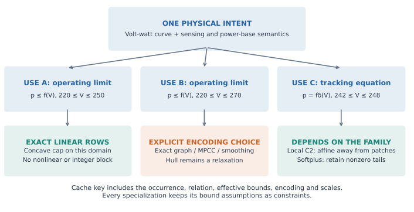
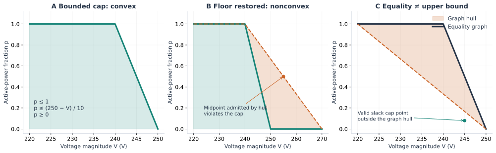
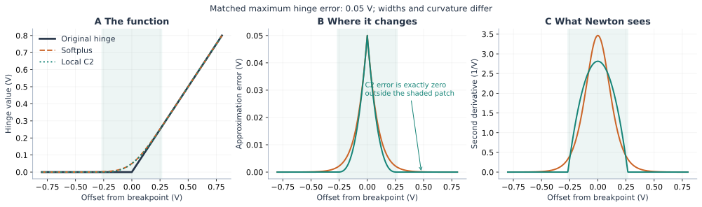

# Bounds and constraint direction change the formulation

**Start with the physical relation, then specialize each occurrence.** A controller
tracking equation, an operating limit and an outer relaxation are different
mathematical objects. The same volt-watt characteristic can require nonlinear or
integer equations at one occurrence and only linear inequalities at another.

For power engineers, the central distinction is **request versus permission**:
an upper limit permits further curtailment. For OR researchers, this is the
**graph versus hypograph** distinction. For implementers, it determines which
bounds and relation metadata must accompany each use of a curve.



## Derive the volt-watt example before choosing a solver

Use a deliberately simple continuous characteristic, with voltage in volts and
power as a fraction of a fixed positive base:

```math
f(V)=\max\left(0,\min\left(1,\frac{250-V}{10}\right)\right).
```

These numbers are pedagogical, not a prescribed grid-code setting.
On `220 ≤ V ≤ 250`, the high-voltage zero floor is unreachable except at its
joining point. Thus `f(V)=min(1,(250-V)/10)` is concave on this domain.
The operating cap `0 ≤ p ≤ f(V)` is **exactly**

```math
p\geq0,\qquad p\leq1,\qquad p\leq(250-V)/10,\qquad 220\leq V\leq250.
```

There is no approximation error and no integer or nonlinear curve block. It is
better to call this an **exact polyhedral formulation** than a hull approximation.
The existence of the cheap formulation follows analytically; its runtime benefit
in a complete application remains an empirical question.



On `220 ≤ V ≤ 270`, the slopes are `0, -0.1, 0`: the floor restores a slope
increase and concavity is lost. The points `(240,1)` and `(270,0)` satisfy the
cap; their midpoint `(255,0.5)` violates it because `f(255)=0`. This proves
nonconvexity, independently of any solver experiment. The hull fills that gap.

Even on the restricted domain, **`p = f(V)` is generally nonconvex**. Replacing
it by upper inequalities allows slack. Maximizing power does not generally make
this replacement exact when power also changes voltage, costs, limits, or other
devices. An objective-specific exactness claim needs its own proof.

Likewise, `conv(graph(f))` is not the entire hypograph. It has a lower boundary:
in panel C it excludes a valid slack cap point. To use a graph hull for an upper
limit, introduce `z` in the graph hull and impose `p ≤ z`. Projection onto `(V,p)`
is exact for a concave `f` on the chosen domain. Direct supporting lines achieve
the same cap without the lifted weights or `z`. For a nonconcave curve this
projection remains a relaxation. Epigraphs reverse the condition: `p ≥ f(V)` is
convex when `f` is convex. These are standard convex-analysis distinctions; see
Boyd and Vandenberghe, [Convex Optimization, §3.1](https://web.stanford.edu/~boyd/cvxbook/index.html).

## Inspect the plan and build the relation

```@example bounded_relations
using PowerOptLab,JuMP,Ipopt
intent=VoltVarWattIntent(
    volt_watt=PWLFunction([220.,240.,250.,270.],[1.,1.,0.,0.]))
plan=plan_pwl_relation(intent.volt_watt,(220.,250.);relation=:upper)
@assert plan.shape==:concave && plan.strategy==:supporting_lines
(plan.strategy,plan.semantics,plan.lines)
```

`relation=:equal`, `:upper`, or `:lower` specifies the meaning of the output.
`formulation=:auto` applies only justified exact affine/polyhedral lowering. An
unresolved plan can be inspected; attempting to build it raises
`UnsupportedFormulation` before adding constraints. This avoids silently choosing
a different problem or an optimizer when the domain is nonconvex.

```@example bounded_relations
m=Model(Ipopt.Optimizer)
set_silent(m)
@variable(m,220<=V<=250,start=245.)
@variable(m,p>=0)
@constraint(m,V==245.)
h=formulate_control_relation!(m,intent,:volt_watt,V,p;relation=:upper)
@objective(m,Max,p)
optimize!(m)
@assert is_solved_and_feasible(m)
@assert isapprox(value(p),.5;atol=1e-6)
@assert h.graph===nothing
(h.plan.strategy,audit_pwl_relation(h))
```

Ipopt solves these linear rows in the core tutorial because it is already a
package dependency. HiGHS is the natural LP comparison in the optional example.
The choice here is not a recommendation to use an NLP solver for an LP.

Bounds are read from JuMP variable-bound attributes or a fixed input value. An
explicit `domain=(lower_V,upper_V)` is intersected with them. A general expression
requires an explicit finite domain. Scales retain their physical meaning:
`input_scale*V` is voltage and `output_scale*p` is a fraction. With normalized
variables, declaring the physical domain explicitly also avoids a tiny numerical
round-trip across an exact breakpoint influencing shape classification. The
planner does not round away small nonconvex segments: slope ordering is compared
using exact rational arithmetic for the supplied Float64 curve data; emitted
solver coefficients and residual checks still use floating-point arithmetic.

The builder **adds its effective domain as a constraint**, even when it inferred
that domain from variable bounds. If those attributes are later loosened, the
old specialization remains restricted to its original domain. Rebuild to expand
the feasible set. Tightening the bounds and calling again produces a new plan
and block. It does not retroactively simplify old constraints.

Repeated calls share a handle only at the same input/output variables with the
same effective domain, relation, encoding, scales, specialization setting and
lowering target. General expressions are not cached; affine and quadratic inputs
are copied for faithful audits. Prepared intent is reusable across models,
but model-specific relation handles are not. `plan_pwl_relation` is a pure
inspection interface. The builder shares physical plans across distinct variables
with the same curve/domain/relation/encoding, then separately caches instantiated
blocks by their actual input/output variables and scales. This avoids repeating
shape analysis for a fleet while preserving occurrence-specific equations.
The existing `formulate_control_curve!` remains an output-graph builder; use the
new relation builder when the output already exists or its one-sided meaning
matters. Full IBR stamping is not automatically rewritten by this new interface.

### A comparison switch, not a hidden replacement

Supply `formulation=ExactPWLGraph()`, `PWLConvexHull()`,
`ComplementarityGraph()`, or a smoothing explicitly when required.
`specialize=false` retains that encoding for a controlled comparison. For example,
on the concave domain a graph-hull upper relation remains mathematically exact
when specialization is disabled, but uses lifted rows; it is labeled accordingly.
On the wider domain it is an outer relaxation. No solver status decides this
classification.

```@example bounded_relations
include(joinpath(dirname(pathof(PowerOptLab)),"..","scripts","formulations","bounded_relations.jl"))
rows=BoundedRelationExample.run()
@assert all(r->r["run_status"] in ("finished","unsupported"),rows)
@assert all(r->r["run_status"]=="unsupported" || r["strict_solver_success"],rows)
[(r["method"],r["configuration"].upper_V,r["configuration"].relation,
  r["configuration"].specialize,r["variables"],r["metrics"].strategy,
  r["metrics"].canonical_violation)
 for r in rows if r["run_status"]=="finished" && r["configuration"].specialize]
```

The script crosses three domains, equality/upper relations and the specialization
switch. It records build/solve times, model dimensions, selected strategies,
semantics and canonical violations through the configurable runner. The optional
solver tutorial also runs its LP/MILP comparisons with HiGHS. At 245 V the wider
domain's maximizing hull gives `5/6`, while the exact graph/cap gives `1/2`.
The earlier [compilation tutorial](compilation.md) used an upper endpoint of
280 V and obtained `0.875`: **the different domain explains the different hull**.
These are fixed-voltage checks, not scalability results or full OPF benchmarks.

The HiGHS example on `[220,250]` V gives the following **constructed model**
counts for the upper relation. Counts include variable bounds, the declared-domain
row and the fixed-voltage constraint; they are before solver presolve.

| Construction | Variables | Constraints | Semantics |
|:--|--:|--:|:--|
| Specialized supporting lines | 2 | 7 | Exact cap |
| Unspecialized lifted graph hull, projected as a cap | 5 | 11 | Exact cap |
| Unspecialized logarithmic segment graph, projected as a cap | 7 | 20 | Exact cap |

Direct supporting lines give the most compact of these constructed models.
No statistically meaningful runtime ranking is inferred from this tiny case.

## Compact patches permit exact local simplification



For a hinge `max(z,0)`, softplus satisfies

```math
h_\epsilon(z)-\max(z,0)=\epsilon\log(1+e^{-|z|/\epsilon})>0
```

at every finite `z` in real arithmetic. It has globally supported error and
curvature, though numerical evaluation can round tiny tails away. A complete
PWL curve is a signed sum of hinges, so its errors can cancel at particular
points; “softplus changes everything” is a support statement about its hinges,
not a claim of nonzero curve error at every input.

Local C2 instead replaces the hinge only on `[-δ,δ]`. Outside that patch it
matches the original hinge, including its first two derivatives. This gives a
precise compiler rule for a hinge at `k`: if `U ≤ k-δ`, replace it by zero; if
`L ≥ k+δ`, replace it by `V-k`. Keep only patches intersecting the feasible
voltage interval. Overlapping patches are allowed; global curve smoothness and
error follow the existing signed hinge contracts, not generic spline fitting.

```@example bounded_relations
c2=plan_pwl_relation(intent.volt_watt,(242.,248.);
    formulation=LocalC2Formulation(.1))
soft=plan_pwl_relation(intent.volt_watt,(242.,248.);
    formulation=SoftplusFormulation(.1))
@assert c2.strategy==:affine && soft.strategy==:smooth
(c2.strategy,soft.strategy)
```

The requested softplus is preserved even though the original PWL function is
affine on that interval. Truncating its tails would introduce a new approximation
and would need a separate error budget and audit. A local C2 law can become
exactly affine there. Neither family is universally cheaper: matching their
error bounds requires different widths, and curvature, sparsity and solver
linear algebra all affect cost. The figure uses equal **hinge** errors; complete
volt-var/watt budgets additionally depend on slope changes. See the
[smoothing contracts](error_budgets.md), Chen and Mangasarian's
[smoothing framework](https://doi.org/10.1007/BF00249052), and
[BMOPFTools' smooth-droop note](https://github.com/frederikgeth/BMOPFTools.jl/blob/main/docs/src/relu_softplus_encoding.md).
We use the latter's progression from curve to derivatives and numerical
implementation, while distinguishing approximation error from solver robustness.

## Voltage magnitude and the rest of OPF

An inferred bound must apply to the **actual sensed quantity**. A phase-voltage
limit does not automatically certify a bound on positive-sequence voltage, a
line-to-line measurement, a filtered signal or a worst-phase aggregate. This
frontend reads declared scalar bounds; it does not infer them from arbitrary
network constraints, optimize bound-tightening subproblems, or rewrite sensing.

There is a further useful exact formulation. Let `u=(vᵣ,vᵢ)` and `V=‖u‖₂`.
On the domain without the floor, the cap can be written

```math
p\leq1,\qquad 10p+\|u\|_2\leq250.
```

The latter is second-order-cone representable as `‖u‖₂ ≤ 250-10p`.
For a fixed positive power base this can eliminate a magnitude equality **if
that magnitude has no other uses requiring equality**. It is an analytic design
example, not an implemented automatic norm rewrite. Voltage upper bounds are
also norm upper bounds. However, a positive voltage **lower** bound
`‖u‖₂ ≥ Vmin` is generally nonconvex in rectangular coordinates; retaining
`V²=vᵣ²+vᵢ²` as an equality also retains nonconvexity. AC power equations and
other controller logic do not disappear when this one cap becomes convex.
A variable power base multiplying the curve can introduce additional nonlinear
coupling; the positive constant `output_scale` keyword does not model that case.

## Design a fair computational experiment

Keep separate comparisons for (a) equivalent exact feasible sets, (b) different
smooth approximations at matched physical error, and (c) relaxations with audited
gaps. Cross realistic bound ranges, relation types, breakpoints reached by the
solution, existing integer decisions, solver/scaling choices and network model
classes. Warm Julia before measuring fresh builds; retain cold-start costs when
deployment latency matters. Record source/environment versions, problem sizes,
integer counts, sparsity, solve outcomes, physical residuals and MIP gaps where
available. A smaller expression graph alone does not establish a faster solve.
The supplied runner supports configurations/custom metrics without prescribing
this as a mandatory research campaign.

### Reproduce and reuse the diagrams

The SVGs are resolution-independent; matching PDFs are in `docs/src/assets/formulations`
for teaching slides or papers. Regenerate with:

```sh
julia --project=. scripts/formulations/figure_data.jl /tmp/pol-hinge-figure.csv
# In a separate Python plotting environment:
pip install -r scripts/formulations/requirements-figures.txt
python scripts/formulations/diagrams.py /tmp/pol-hinge-figure.csv
```

Hinge data come from the actual Julia implementation. Geometry is analytic; the
control-iteration illustration in the next tutorial is explicitly synthetic.
