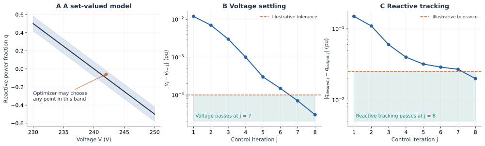

# Tolerance bands, control convergence and solver choice

A useful model must specify both **which behavior is permitted** and **how the
computed result is assessed**. Smoothing error, a firmware deadband, a control-loop
stopping tolerance and an NLP feasibility tolerance have different meanings.
Making their units comparable does not make them interchangeable.

## What OpenDSS tolerances actually check

EPRI distinguishes functions that control reactive power from functions that
limit active power. This is consistent with representing volt-var as tracking
and volt-watt as a cap, although capability allocation and other control modes
must still be considered. See the
[InvControl model description](https://opendss.epri.com/OpenDSSInvControlElementModel.html).

| Property | Quantity assessed or adjusted | Modeling implication |
|:--|:--|:--|
| `VarChangeTolerance` | Desired reactive output versus actual reactive output in the same control iteration, in the relevant per-unit reactive base | A residual-like stopping criterion; the desired value is the processed control target |
| `VoltageChangeTolerance` | Monitored per-unit voltage change between consecutive control iterations | An iteration settling criterion, not a static voltage-error band |
| `ActivePChangeTolerance` | Desired active-power limit versus the limit produced by the convergence process | Agreement of limits; output power may legitimately be below the limit |
| `DeltaQ_Factor`, `DeltaP_Factor` | Update steps in the control iteration | Affect convergence behavior; are not permitted curve-error magnitudes |
| `RefReactivePower` | Provided/absorbed reactive-power normalization | Distinguish fixed maximum-var bases from available-var bases |
| `RateOfChangeMode`, `LPFTau`, `RiseFallLimit` | Time-step filtering or ramping behavior | Introduce temporal behavior distinct from inner control-loop convergence |

The first, fourth and fifth rows are described by EPRI's
[reactive-control properties](https://opendss.epri.com/PropertiesoffunctionsthatCONTROL.html);
active-limit convergence by its
[active-power properties](https://opendss.epri.com/PropertiesoffunctionsthatLIMITac.html);
voltage settling and temporal settings by its
[common properties](https://opendss.epri.com/Commonproperties.html).
The [DSS-Extensions property reference](https://dss-extensions.org/dss-format/InvControl.html)
also documents hysteresis and voltage-reference choices. Check the deployed
engine/version and set experiment values explicitly: generated default tables
and prose can disagree, for example for `VoltageChangeTolerance`. We do not
infer a firmware model from default settings alone.

EPRI's [control-action criteria](https://opendss.epri.com/Checkingtheneedforcontrolaction.html)
explain why the raw volt-var curve is not always the target in the residual:
capabilities, control combinations and processing matter; provided/absorbed
normalization can differ and use prior-iteration bases. The active-power check
compares limits, not actual dispatched watts. Convergence also includes voltage
settling and the absence of further queued control actions. A static constraint
on the raw curve cannot reproduce all of this behavior.

## A band is a useful abstraction—with explicit assumptions

For fixed bases and a memoryless target, define the **residual**
`r(Q,V)=Q-Qtarget(V)`. A two-sided band is

```math
-\tau_Q\leq r(Q,V)\leq\tau_Q,
\qquad\text{equivalently}\qquad
Q=Q_{target}(V)+e,\quad |e|\leq\tau_Q.
```

If `fᴠᴠ` denotes a residual, “`fᴠᴠ + tolerance = 0`” can express this only if
“tolerance” is a **bounded signed variable**. Adding a fixed positive number
shifts a curve; it does not create a band. If `fᴠᴠ(V)` denotes the target output
itself, the equation must also include `Q`.

A residual band can be an intentional model of allowable tracking discrepancy,
an uncertainty set, or a diagnostic acceptance test. Specify which. Putting the
band inside an optimizer lets the optimizer select a favorable error. It is then
a set-valued control model, not faithful reproduction of a deterministic control
iteration. Robust claims require the appropriate quantifier over that set;
existence of a favorable error does not establish safety for every admissible
error. Hysteresis and temporal filters need state, not a wider static band.



Panel A uses a visually enlarged band of 0.08 pu; the executable example below
uses 0.025 pu. **The iteration sequences are illustrative, not an OpenDSS simulation.** They
show voltage settling passing at iteration 7 while reactive tracking passes at
iteration 8. A small change between successive iterates alone is not proof of
agreement with the intended curve or a unique equilibrium.

The relation API can express an intentional band without treating it as a solver
option. Here the target is affine on the declared domain, so both sides lower
exactly to linear inequalities:

```@example tolerance_band
using PowerOptLab,JuMP,Ipopt
qcurve=PWLFunction([230.,250.],[.5,-.5];input_unit=:V,output_unit=:pu)
tau_q=.025
m=Model(Ipopt.Optimizer); set_silent(m)
@variable(m,235<=V<=245,start=242.)
@variable(m,q)
@constraint(m,V==242.)
# q - tau <= f(V) and q + tau >= f(V).
upper=formulate_pwl_relation!(m,qcurve,V,q-tau_q;relation=:upper)
lower=formulate_pwl_relation!(m,qcurve,V,q+tau_q;relation=:lower)
@objective(m,Max,q)
optimize!(m)
@assert is_solved_and_feasible(m)
@assert isapprox(value(q),-.075;atol=1e-6)
(value(q),primitive_value(qcurve,242.),tau_q)
```

The canonical target is `-0.1`; optimization deliberately chooses the band edge
`-0.075`. Neither smoothing nor a solver failure caused this difference.
The output passed to each relation audit includes its signed band shift; report
`q-f(V)` separately when studying the physical tracking residual.

## Translate physical budgets without conflating them

With a **fixed** 10 kvar base, a chosen per-unit reactive tolerance of `0.025`
corresponds to 250 var. With a 230 V voltage base, `1e-4` pu corresponds to
0.023 V between iterations. These are illustrative settings; an available-var
base or asymmetric absorption/injection ratings changes the translation.

Let `|fε(V)-f(V)| ≤ εQ` and let the candidate satisfy
`|Q-fε(V)| ≤ ηQ` in physical var. Then

```math
|Q-f(V)|\leq\eta_Q+\epsilon_Q.
```

If the target was evaluated at a different voltage `Ṽ`, and `f` is Lipschitz
with constant `LQ` on the relevant domain, add `LQ |Ṽ-V|`. A measured iteration
change may support that comparison of successive targets under fixed settings;
it is not automatically a bound on voltage measurement error or the distance to
an unknown equilibrium. These inequalities are elementary residual accounting,
not OpenDSS acceptance-policy equivalents.

```@example tolerance_band
Qbase=10_000. # var
slope=Qbase*.05 # var/V on this segment
smoothing_budget=25. # var
solver_residual=2. # independently audited physical var
lagged_voltage_difference=230.0 * 1e-4 # V
bound=smoothing_budget+solver_residual+slope*lagged_voltage_difference
@assert isapprox(bound,38.5)
(bound_var=bound,illustrative_tracking_tolerance_var=Qbase*.025)
```

This leaves room below 250 var **under the stated assumptions**. It says nothing
by itself about voltage security, hardware capability or nonlinear equilibrium
distance. If an inequality surrogate can overestimate a cap by `ε`, a simple
conservative construction is `p ≤ fε(V)-ε`; positive solver residual allowance
must also be deducted or independently audited. A signed tighter bound can
reduce this margin. Near a zero-output cap, an overly conservative smooth margin
can conflict with `p ≥ 0`; compact exact tails or an exact bound formulation can
avoid that artificial infeasibility. Do not automatically clip a smooth margin
without assessing the changed feasible set.

Smoothing theory motivates explicit approximation parameters and residual
analysis, not an identification of those parameters with stopping tolerances.
See Chen and Mangasarian's
[smoothing functions](https://doi.org/10.1007/BF00249052) and Chen's
[nonconvex smoothing review](https://doi.org/10.1007/s10107-012-0569-0).
The [physical error tutorial](error_budgets.md) develops derivative bounds and
local equilibrium-response estimates with their additional assumptions.

### Iteration stability is not the same as solvability

A scalar linearized illustration makes this concrete. Let the network map be
`V=Vs+κQ` with `κ>0` and the local droop slope be `f′=-a`, `a>0`.
Direct target iteration has derivative `-κa`, and can oscillate and diverge when
`κa>1`. Yet the simultaneous residual `Q-f(Vs+κQ)` has derivative `1+κa>0`:
the affine problem has a unique root. For `κa=2`, the iteration multiplier is
`-2`; a relaxed update with gain `α` has multiplier `1-3α`, which is contractive
for `0<α<2/3`. This is our analytic illustration, not a reconstruction of
OpenDSS's update algorithm. It explains why difficulty with an external control
iteration need not imply that the simultaneous optimization equations are
unsolvable. Smoothing introduces another choice; it is not a substitute for
checking either iteration stability or nonlinear-model conditioning.

## Match the whole mathematical model to the solver

| Overall model after lowering | Suitable solver class | What the result can establish |
|:--|:--|:--|
| Linear continuous model with polyhedral caps | LP solver | Global optimality of the posed LP, subject to solver tolerances and verified status |
| Convex continuous quadratic, conic or nonlinear model | A solver supporting that convex class | Convexity supports global interpretation of an optimum; numerical residuals and status still require assessment |
| Otherwise linear model with existing integer decisions and exact PWL graphs | MILP solver, e.g. HiGHS with PiecewiseLinearOpt formulations | Incumbent plus valid bounds/gap when reported; scalability depends on formulation strength and branching |
| Convex conic constraints plus integers | A solver supporting the resulting mixed-integer convex class | Appropriate bounds/gaps when the formulation and solver support them; a MILP solver alone is insufficient for arbitrary cones |
| Smooth nonconvex AC equations, continuous decisions | Local NLP solver, e.g. Ipopt or MadNLP | A local candidate and termination diagnostics; no general global-optimality or convergence guarantee |
| Nonconvex equations with complementarity | MPCC-capable method, e.g. CCOpt with its external relaxation/homotopy | Candidate, complementarity residuals and method-specific stationarity information; not automatically a certified exact MPCC point |
| Nonconvex AC equations plus integer graph/device choices | A suitable nonconvex MINLP strategy | Local heuristics or global bounds depending on the method; requires explicit assessment of backend capabilities and relaxations |

Ipopt explicitly targets local solutions of smooth problems, including nonconvex
ones; see its [official documentation](https://coin-or.github.io/Ipopt/).
[MadNLP](https://madsuite.org/MadNLP.jl/stable/) provides a sparse interior-point
NLP route, while [CCOpt](https://github.com/madsuite-org/CCOpt.jl) targets MPCC
structure. These NLP routes and the present CCOpt integration do not enforce integer
decisions. Their flexibility fits nonconvex continuous OPF, but does not remove
constraint degeneracy, ill-conditioning, start sensitivity or local minima.
The benchmark literature on
[nonlinear complementarity-constrained optimization](https://arxiv.org/abs/2312.11022)
explains why ordinary NLP constraint qualifications and stationarity conclusions
need care for MPCCs.

[HiGHS](https://highs.dev/) supports LP/MIP and convex QP; it is not a general
nonconvex AC NLP solver. PiecewiseLinearOpt constructs formulations; it does not
solve the surrounding model or turn AC equalities into linear physics. Its
[underlying formulation research](https://arxiv.org/abs/1708.00050) motivates
small, strong graph encodings, particularly when integer decisions already exist.
For nonconvex MINLP, even a branch-and-bound interface backed by local NLP solves
must not be mistaken for a global certificate: the
[Bonmin documentation](https://coin-or.github.io/Bonmin/options_set.html)
explicitly discusses the limits of nonconvex node bounds and outer approximations.

The practical choice is **model complexity together with a compatible, scalable
solver**. A more detailed AC model may justify a local NLP approach; a planning
model with discrete devices and justified linear/convex network approximations
may favor MILP/MICP. Replacing a control graph by a hull changes the model;
replacing AC physics by a relaxation changes it again. Audit those changes
separately from the solver outcome. The existing runner records these outcomes
without promoting approximate candidates or adding local continuation methods.

## Suggested learning and experiment paths

* **Power engineers:** start with the cap/equality geometry and the units of
  tolerances; then replay candidate controls and check hardware/network residuals.
* **PhD candidates:** derive the bounded cap and signed error bounds; compare
  domains and encodings using the executable examples, then introduce feedback.
* **OR researchers:** inspect relation plans, convexity certificates of scalar
  restrictions, lifted graph projections, integer structure and full-model
  nonconvexities before designing performance comparisons. Here “certificate”
  concerns slope ordering of a scalar curve, not formal verification of the
  emitted floating-point model or certification of solver output.

The four supplied diagrams cover locality/curvature, feasible-set geometry,
contextual lowering and stopping-versus-model tolerances. Natural next study
figures are relaxation gap versus bound width, build/solve cost versus device
count, and physical error versus smoothing width across starts. Generate these
from recorded experiments; a schematic should not pretend to establish a
numerical winner.
