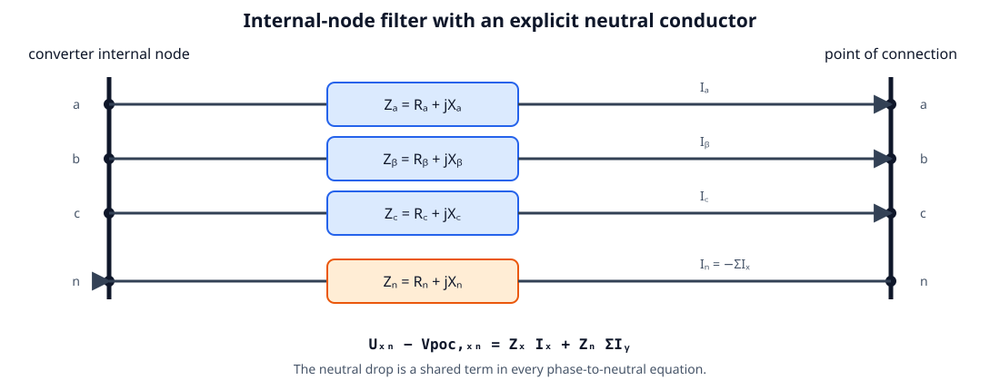
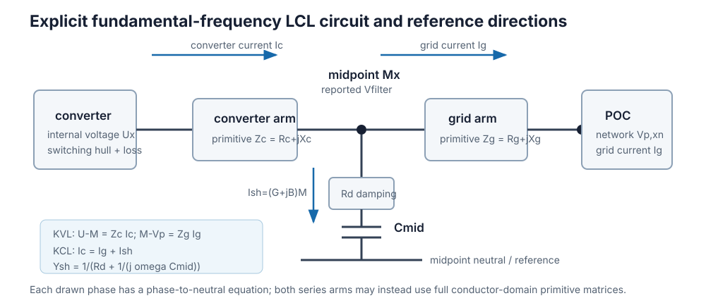
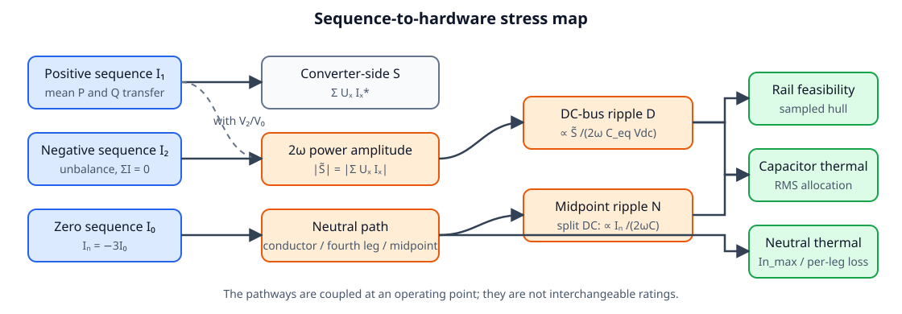
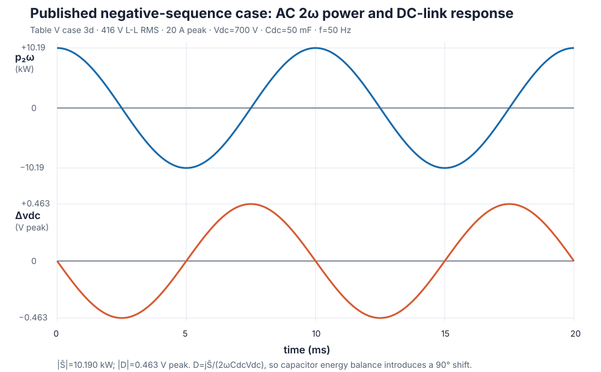
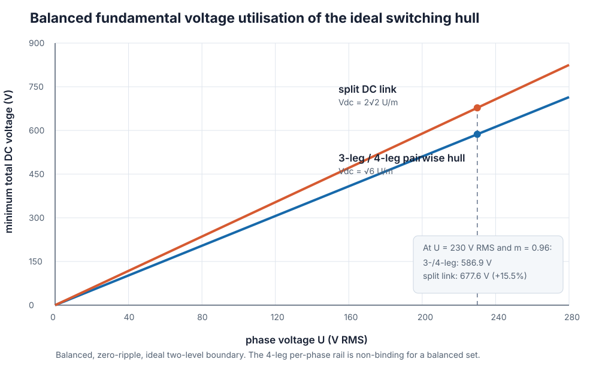
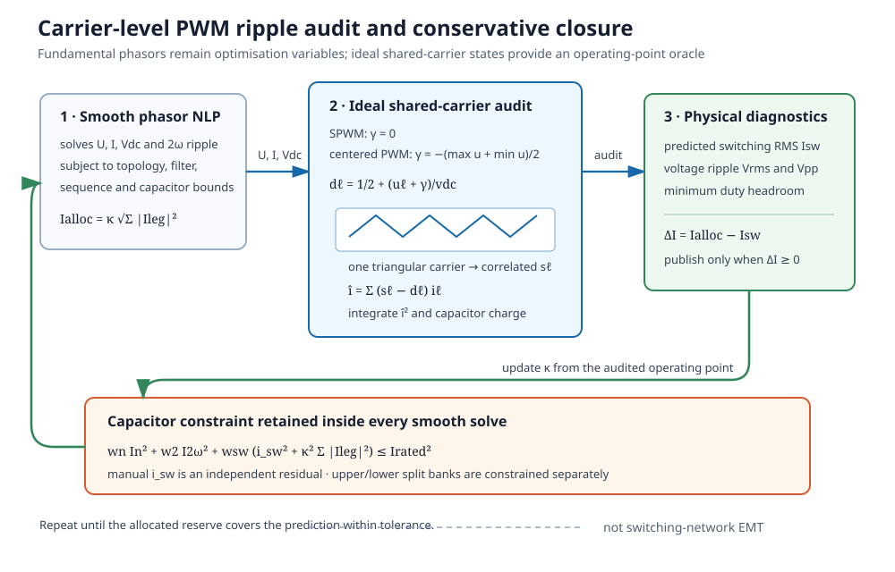
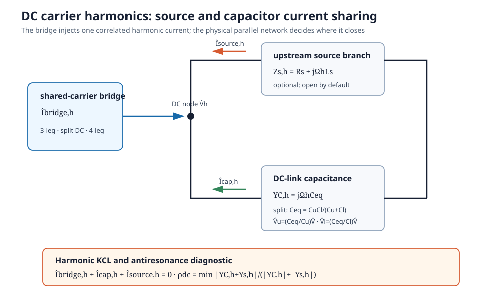
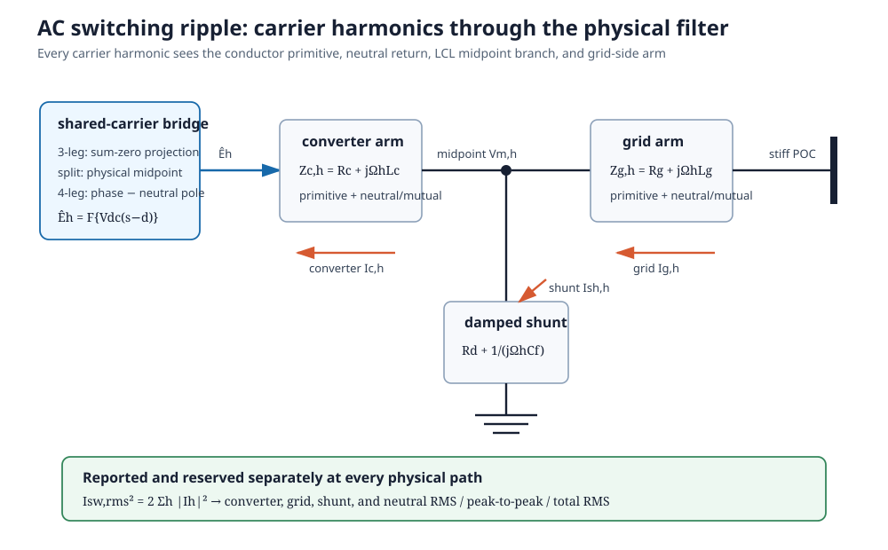

# [Scientific foundations](@id ibr-scientific-foundations)

This page derives the equations stamped by [`AdvancedInverter`](@ref). All
phasors are fundamental-frequency RMS quantities in an `a-b-c` phase order.
Displayed equations use SI units; the implementation applies the same equations
after converting AC quantities to the network's per-unit bases.

## 1. Reference directions and internal node

For phase `x`, current ``I_x`` is positive from the converter toward the POC.
AC power is positive when injected into the network. DC power is positive when
drawn from the DC source. Let ``V_{p,xn}`` and ``U_{xn}`` be POC and converter
internal phase-to-neutral voltages. The most general implemented series element
is a primitive conductor-domain impedance ``\mathbf Z_f=\mathbf R_f+j\mathbf
X_f``. Its conductor order is `phase_terminals`, followed by `neutral` when a
physical neutral exists. In the reduced, single-arm model, with

```math
\mathbf J=[I_a,I_b,I_c,I_n]^T,\qquad I_n=-\sum_x I_x,
```

conductor KVL is



```math
\boldsymbol{\Delta V}=\mathbf Z_f\mathbf J,
\qquad
\boxed{U_{xn}-V_{p,xn}=\Delta V_x-\Delta V_n.}
```

The scalar parameters are the diagonal special case. With phase impedance
``Z_x`` and neutral impedance ``Z_n``, subtracting the neutral-conductor drop
recovers

```math
\boxed{U_{xn}-V_{p,xn}=Z_xI_x+Z_n\sum_y I_y.}
```

The second term is shared by all phases. Omitting it treats the neutral as an
ideal zero-impedance reference even when a real return conductor is present. For
a 3-wire bridge, ``\sum I_x=0``, so it vanishes automatically. For a
single-phase two-wire connection it gives the expected loop impedance
``Z_x+Z_n``. Full `r_filter_matrix` and `x_filter_matrix` inputs additionally
retain unequal self impedances and phase-phase, phase-neutral, or neutral-phase
mutual coupling. Reciprocity is enforced by symmetry; ``\mathbf R_f`` must be
positive semidefinite so the element cannot generate real power.

### Explicit LCL midpoint

When a grid-side arm or `c_filter_mid` is supplied, the model inserts an
internal filter midpoint. Let ``M_{xn}`` be its phase-to-neutral voltage,
``I_{c,x}`` converter-arm current, and ``I_{g,x}`` grid-arm current:



```math
\boxed{U-M=\mathcal Z_c(I_c)},\qquad
\boxed{M-V_p=\mathcal Z_g(I_g)},\qquad
\boxed{I_{c,x}=I_{g,x}+I_{sh,x}}.
```

``\mathcal Z_c`` and ``\mathcal Z_g`` denote the primitive conductor-domain
drop operation above, including subtraction of the neutral-conductor drop. Each
arm may use independent scalar or full matrix parameters. The midpoint branch
is a per-phase capacitor in series with a damping resistor:

```math
Y_{sh}(\omega)=\frac{1}{R_d+1/(j\omega C_f)}=G_f+jB_f,
\qquad I_{sh,x}=Y_{sh}M_{xn}.
```

Consequently, converter current and grid current are no longer interchangeable.
`i_max` limits ``I_c``; `i_grid_max` independently limits ``I_g``. For a
three-leg bridge, ``\sum I_c=0`` still applies at the converter. A grounded-wye
midpoint capacitor can nevertheless exchange zero-sequence current with a
physical grid neutral; this is a filter path, not a fourth semiconductor leg.

If ``C_f=0``, KCL gives ``I_c=I_g`` and the two series arms collapse exactly to
their summed impedance. This limiting case is tested against the original
single-arm formulation.

The optional POC shunt remains a separate scalar phase-to-neutral susceptance
``b_p``:

```math
I_{p,sh,x}=j b_p V_{p,xn}.
```

It changes POC reactive exchange but is not part of the LCL midpoint KCL.

The explicit LCL is evaluated only at the snapshot's fundamental frequency. For
scalar inductive arms, the result reports the familiar undamped estimate

```math
f_r=\frac{1}{2\pi}\sqrt{\frac{L_c+L_g}{L_cL_gC_f}},
\qquad L_c=\frac{X_c}{\omega},\quad L_g=\frac{X_g}{\omega}.
```

This is a screening diagnostic, not a stability claim. Matrix-valued filters do
not have one scalar resonance, and controller delay, grid impedance, damping
strategy, frequency-dependent parasitics, and modal resonances require an
impedance scan or dynamic model.

## 2. Power and loss bookkeeping

Converter-side and POC powers follow directly from their respective currents:

```math
S_{conv}=P_{conv}+jQ_{conv}=\sum_x U_{xn}I_{c,x}^*,\qquad
S_{poc,series}=\sum_x V_{p,xn}I_{g,x}^*.
```

For the reduced primitive, the real-power difference is

```math
P_{conv}-P_{poc,series}=\Re\{\mathbf J^H\mathbf Z_f\mathbf J\}
=\mathbf J^H\mathbf R_f\mathbf J.
```

For the scalar diagonal parameterisation this becomes

```math
P_{conv}-P_{poc,series}
=\sum_x R_x|I_x|^2+R_n\left|\sum_x I_x\right|^2.
```

For the explicit LCL, the same balance extends across both arms and the damping
branch:

```math
\boxed{P_{filter}=P_{conv}-P_{poc}
=\mathbf J_c^H\mathbf R_c\mathbf J_c
 +\mathbf J_g^H\mathbf R_g\mathbf J_g
 +R_d\sum_x|I_{sh,x}|^2.}
```

`result.p_filter_loss` reports this terminal difference. It is distinct from
the fitted semiconductor `p_loss`; `p_dc=p_conv+p_loss` therefore includes the
filter loss implicitly through the converter-side power required to deliver a
given POC setpoint.

The semiconductor loss fit is kept separate:

```math
P_{loss}=P_0+a\sum_{\ell\in\mathcal L}|I_\ell|
              +c\sum_{\ell\in\mathcal L}|I_\ell|^2,
\qquad P_{dc}=P_{conv}+P_{loss}.
```

``\mathcal L`` contains the three phase legs and, for `:FOUR_LEG`, the neutral
leg carrying ``I_n``. For `:SPLIT_DC` there is no fourth semiconductor leg;
neutral-induced capacitor heating is handled in the capacitor budget. The same
``a`` and ``c`` are applied to every included leg, so they should be understood
as an equivalent fitted per-leg curve. Device-specific phase/neutral coefficients,
temperature feedback, switching-state dependence, and reverse-conduction maps
remain future refinements.

Numerically, the current-linear term uses the shifted smooth norm
``\sqrt{|I|^2+\epsilon^2}-\epsilon`` with ``\epsilon=1`` mA. It is zero at zero
current, differs from ``|I|`` by less than 1 mA, and avoids the singular
Jacobian of an exact current-magnitude equality at the origin.

The non-branching equality is important: it stays valid in charging and
discharging without binary direction variables or sign-dependent efficiency
branches.

## 3. Symmetrical components and physical channels

With ``\alpha=e^{j2\pi/3}``, Fortescue components are

```math
\begin{bmatrix}I_0\\I_1\\I_2\end{bmatrix}
=\frac13
\begin{bmatrix}
1&1&1\\1&\alpha&\alpha^2\\1&\alpha^2&\alpha
\end{bmatrix}
\begin{bmatrix}I_a\\I_b\\I_c\end{bmatrix}.
```

The implementation can constrain each RMS magnitude independently with
`i_zero_max`, `i_positive_max`, and `i_negative_max`, and reports all three.
For a physical neutral,

```math
I_n=-(I_a+I_b+I_c)=-3I_0,\qquad |I_n|=3|I_0|.
```

This separates two effects that are often incorrectly combined into a single
“unbalance” number. Zero sequence purchases a neutral-current path. Negative
sequence can have ``I_n=0`` but, when it interacts with positive-sequence
voltage, produces double-frequency power. Voltage unbalance also couples the
channels, so these statements are mechanisms, not a promise that an arbitrary
unbalanced operating point contains only one stress.



## 4. Why the unconjugated product produces 2ω power

For RMS phasors ``U`` and ``I``, write instantaneous waveforms as

```math
u(t)=\sqrt2\,\Re\{Ue^{j\omega t}\},\qquad
i(t)=\sqrt2\,\Re\{Ie^{j\omega t}\}.
```

Their product separates into mean and double-frequency terms:

```math
u(t)i(t)=\Re\{UI^*\}+\Re\{UIe^{j2\omega t}\}.
```

Summing phases therefore gives ordinary complex power from the **conjugated**
sum and oscillating-power amplitude from the **unconjugated** sum:

```math
S=\sum_x U_xI_x^*,\qquad
\boxed{\widetilde S=\sum_x U_xI_x}.
```

In rectangular coordinates,

```math
\widetilde S_{re}=\sum_x(U_x^{re}I_x^{re}-U_x^{im}I_x^{im}),\quad
\widetilde S_{im}=\sum_x(U_x^{re}I_x^{im}+U_x^{im}I_x^{re}).
```

``|\widetilde S|`` is a sinusoidal **amplitude**, not RMS. This convention is
validated against the six prescribed current patterns in Deakin, Heidari, and
Deng's Table V and their PLECS results.



The figure is regenerated by `docs/scripts/generate_ibr_figures.jl` from the
Table V phasors and the equations below. It deliberately labels peak and RMS
conventions rather than relying on an ambiguous “ripple magnitude.”

## 5. DC-bus energy balance and 2ω voltage ripple

Let the mean DC voltage be ``V_{dc}``, the small ripple be ``d(t)``, and the
equivalent bus capacitance be ``C_{eq}``. Linearising the capacitor power around
``V_{dc}`` gives

```math
p_C(t)=C_{eq}v_{dc}\frac{dv_{dc}}{dt}
\approx C_{eq}V_{dc}\frac{dd}{dt}.
```

Assuming the DC source contributes negligibly at ``2\omega`` and integrating the
oscillating AC power yields the bus-ripple phasor

```math
\boxed{D=\frac{j\widetilde S}{2\omega C_{eq}V_{dc}}},\qquad
d(t)=\Re\{De^{j2\omega t}\}.
```

Thus ``D_{re}=-\widetilde S_{im}/(2\omega C_{eq}V_{dc})`` and
``D_{im}=\widetilde S_{re}/(2\omega C_{eq}V_{dc})``. A monolithic link uses
``C_{eq}=C_{dc}``. For split-link half-banks ``C_u`` and ``C_l`` in series,

```math
\boxed{C_{eq}=\frac{C_uC_l}{C_u+C_l}}.
```

The symmetric case ``C_u=C_l=C_{dc}`` recovers ``C_{eq}=C_{dc}/2``.
`result.dv2` is ``|D|``, a peak sinusoidal voltage amplitude, and `dv2_max`
bounds it.

This derivation is first order. It neglects products of ripple quantities,
higher harmonics, DC-source impedance at ``2\omega``, ESR/ESL, and controller
response. A practical small-ripple audit should report ``|D|/V_{dc}``.

## 6. Split-link midpoint motion

In `:SPLIT_DC`, neutral current moves the capacitor midpoint. Let
``C_\Sigma=C_u+C_l`` and use the converter-reference sign convention implemented
by the sampled switching hull. The fundamental midpoint-ripple phasor has RMS
magnitude

```math
\boxed{|N|=\frac{|I_n|}{\omega C_\Sigma}}.
```

The capacitor currents caused by this component divide according to capacitance,
not equally unless the banks match:

```math
I_{n,u}=\frac{C_u}{C_\Sigma}I_n,\qquad
I_{n,l}=\frac{C_l}{C_\Sigma}I_n.
```

With equal stored charge and no balancing action, unequal capacitances also
shift the mean midpoint away from half the total bus:

```math
\boxed{\bar N_{nat}=\frac{V_{dc}(C_u-C_l)}{2C_\Sigma}}.
```

The optional quasi-static balancing actuator transfers a bounded differential
charge ``q_b``:

```math
\bar N=\bar N_{nat}+\frac{2q_b}{C_\Sigma},\qquad
|q_b|\le q_{b,max},\qquad |\bar N|\le \bar N_{max}.
```

`result.dv_mid` reports ``|N|``; `result.v_mid_mean` and
`result.q_mid_balance` report the signed mean shift and balancing action.
`dv_mid_max` and `v_mid_mean_max` can bound the two distinct quantities. The
instantaneous phase reference seen by each half-bridge is formed from
``U_x+N+\bar N``. Fundamental ripple and mean mismatch therefore affect voltage
feasibility as well as capacitor stress; neither is merely a reporting variable.

The balancing variable is a steady-state charge-authority abstraction, not a
controller state. The model does not represent leakage, ESR-induced mean drift,
balancer loss or bandwidth, saturation trajectories, capacitor voltage-dependent
capacitance, tolerance distributions, or ageing. Setting ``C_u=C_l`` and omitting
the actuator reproduces the original stiff symmetric split exactly.

## 7. Ideal switching hull and sampled enforcement

Let ``\theta_k=2\pi(k-1)/N`` and

```math
v_{dc}(\theta)=V_{dc}+D_{re}\cos2\theta-D_{im}\sin2\theta.
```

At each sample, both polarities of the relevant instantaneous converter voltage
must fit inside a fraction ``m=m_{max}`` of the ideal two-level rail:

- `:THREE_LEG`: every line-to-line pair ``u_x-u_y`` fits the full rail and
  ``\sum I_x=0``;
- `:FOUR_LEG`: those pairwise inequalities plus every phase-to-neutral voltage
  fit the full rail, while ``|I_n|\le I_{n,max}``;
- `:SPLIT_DC`: every ``u_x+n+\bar n`` fits half the rail.

For a balanced sinusoid with no ripple, these recover the familiar RMS limits

```math
|U|\le \frac{mV_{dc}}{\sqrt6}\quad\text{(3-leg / 4-leg pairwise hull)},
\qquad
|U|\le \frac{mV_{dc}}{2\sqrt2}\quad\text{(split link)}.
```

The split link therefore requires ``2/\sqrt3\approx1.155`` times the total DC
voltage for the same balanced phase RMS voltage.



Sampling is an **outer approximation**: a peak between samples can be missed.
Increasing `n_samples` tightens the feasible set toward the continuous-time
hull. After every publishable three-phase solve, `result.switching_margin`
evaluates all relevant rail inequalities on a separate grid of at least 3600
angles. A positive value is audited headroom in volts; a negative value exposes
a between-sample violation accepted by the optimisation grid. This dense check
is materially stronger than reporting solver status alone, but it is still a
numerical audit—not an analytic global certificate. Boundary-sensitive studies
should also increase `n_samples` and report convergence; no uniform a priori
error bound is claimed once endogenous DC ripple is included.

## 8. Capacitor RMS thermal allocation

The 2ω capacitor-current amplitude is ``|\widetilde S|/V_{dc}``; its RMS value is

```math
I_{2\omega,rms}=\frac{|\widetilde S|}{\sqrt2V_{dc}}.
```

For a split link, both half-banks carry the common 2ω bus current and reserved
switching component, while the fundamental neutral current divides by
``\alpha_u=C_u/C_\Sigma`` and ``\alpha_l=C_l/C_\Sigma``. The *physical* RMS
currents are therefore

```math
I_{u,rms}^2=\alpha_u^2|I_n|^2+I_{2\omega,rms}^2+i_{sw}^2,
\qquad
I_{l,rms}^2=\alpha_l^2|I_n|^2+I_{2\omega,rms}^2+i_{sw}^2.
```

`i_sw` is a fixed reservation for unmodelled switching-frequency current. To
separate measurement from heating, the model applies user-supplied squared-
current weights ``(w_n,w_{2\omega},w_{sw})``:

```math
I_{u,th}^2=w_n\alpha_u^2|I_n|^2+w_{2\omega}I_{2\omega,rms}^2
            +w_{sw}i_{sw}^2,
```

with an analogous lower-bank equation. Set each weight to the relevant ESR
ratio relative to the rating/reference frequency; ``(1,1,1)`` recovers the
unweighted RMS allocation. Common `i_cap_max` constrains both half-banks, while
`i_cap_upper_max` and `i_cap_lower_max` allow different bank ratings.

`result.i_cap` is the larger *physical* half-bank RMS current;
`result.i_cap_thermal` is the larger thermally equivalent current used by the
ratings. The corresponding upper/lower values are also reported separately.
For reference ESR values ``R_{ESR,u}`` and ``R_{ESR,l}``, the modeled dissipation
is

```math
P_{cap}=R_{ESR,u}I_{u,th}^2+R_{ESR,l}I_{l,th}^2,
```

and is included in ``P_{dc}=P_{conv}+P_{semi}+P_{cap}``. A monolithic link uses
the same construction without the neutral term. These weights approximate the
more general ``\sum_h ESR(f_h,T)|I_h|^2`` relation; they do not model ESR/ESL as
electrical impedances or solve the capacitor temperature.

## 9. Carrier-level PWM ripple and sequential closure

The low-frequency model above cannot infer switching stress from line-frequency
RMS current alone: the DC-link current depends on correlated switch states. For
an ideal two-level leg ``\ell`` with top-switch function
``s_\ell(\theta,\tau)\in\{0,1\}``, frozen fundamental current
``i_\ell(\theta)``, and duty ratio ``d_\ell(\theta)``, the instantaneous and
switching-period-averaged converter input currents are

```math
i_{dc}(\theta,\tau)=\sum_{\ell\in\mathcal L}s_\ell i_\ell,
\qquad
\bar i_{dc}(\theta)=\sum_{\ell\in\mathcal L}d_\ell i_\ell,
\qquad
\hat i=i_{dc}-\bar i_{dc}.
```

Here ``\tau`` is position within a switching period. `:THREE_LEG` and
`:SPLIT_DC` use the three phase legs; `:FOUR_LEG` additionally includes the
neutral leg with ``i_n=-\sum_x i_x``. A shared triangular carrier preserves the
cross-correlation among leg switching functions. PowerOptLab samples that
carrier directly rather than adding independent per-leg ripple RMS values.



For pole command ``u_\ell^*`` and local rail voltage ``v_{dc}(\theta)``,

```math
d_\ell=\frac12+\frac{u_\ell^*}{v_{dc}(\theta)}.
```

SPWM uses zero common-mode command. Centered PWM applies
``\gamma=-[\max_\ell u_\ell+\min_\ell u_\ell]/2`` before forming the duties;
for a four-leg bridge the neutral reference is included in this centering. A
split link has a fixed physical midpoint and therefore supports SPWM only in
this audit. The predicted switching-current RMS is

```math
\boxed{I_{sw,pred}^2=\frac{1}{2\pi}\int_0^{2\pi}
       \mathbb E_\tau\{\hat i(\theta,\tau)^2\}\,d\theta}.
```

The default high-impedance-source case closes the switching current through the
DC-link capacitance:

```math
\frac{d\hat v}{dt}=-\frac{\hat i}{C_{eq}}.
```

The carrier integration therefore also reports total-bus switching-voltage RMS
and the maximum local peak-to-peak excursion. These quantities scale as
``1/(C_{eq}f_{sw})`` under the frozen-current assumption, while
``I_{sw,pred}`` itself is independent of ``C_{eq}`` and ``f_{sw}``.

Putting every carrier state inside the OPF would require a much larger
mixed-integer switching model. The convenience solver instead uses a sequential
majorant. At outer iteration ``r`` the smooth NLP includes

```math
I_{sw,alloc}^{(r)}=\kappa^{(r)}
\sqrt{\sum_{\ell\in\mathcal L}|I_\ell|^2}
```

in each physical and thermal capacitor budget. A carrier audit of the solved
point updates ``\kappa`` until ``I_{sw,alloc}\ge I_{sw,pred}`` within tolerance.
`result.pwm_reserve_margin` reports this inequality and
`result.pwm_modulation_margin` independently checks that all carrier references
remain inside ``[-1/2,1/2]``. The manual `i_sw` parameter is retained as a
quadrature residual for dead time, device commutation, unresolved output-current
ripple, or spectral content outside the enabled ideal carrier calculations.

This procedure is locally self-consistent and conservative at the returned
operating point, but it is not a proof of the globally optimal switched system.
It assumes ideal complementary switches, no dead time, sinusoidal current frozen
within each switching period, and a shared triangular carrier. The optional
finite source branch below relaxes the final open-source assumption.

### 9.1 DC-source current sharing and split-bank voltage

Hammami et al. and Vujacic et al. explicitly place a source R–L impedance in
parallel with the link capacitor at switching frequencies. At retained carrier
harmonic ``\Omega_h=2\pi h f_{sw}``, PowerOptLab uses

```math
Y_{C,h}=j\Omega_h C_{eq},\qquad
Z_{s,h}=R_s+j\Omega_h L_s,\qquad Y_{s,h}=Z_{s,h}^{-1},
```

and solves the DC-node KCL

```math
\boxed{\hat V_h=-\frac{\hat I_{bridge,h}}{Y_{C,h}+Y_{s,h}}},\qquad
\hat I_{C,h}=Y_{C,h}\hat V_h,\qquad
\hat I_{s,h}=Y_{s,h}\hat V_h,
```

so that ``\hat I_{bridge,h}+\hat I_{C,h}+\hat I_{s,h}=0`` for every retained
harmonic. Omitting `pwm_dc_source_r` and leaving `pwm_dc_source_l=0` recovers
the open-source limit exactly. `pwm_dc_harmonics` controls the finite-network
bandwidth; any unretained bridge-current energy is assigned conservatively to
the capacitor for thermal reserve closure, while voltage and source-current
diagnostics contain the retained series only.

For a split link, ``C_{eq}=C_uC_l/(C_u+C_l)`` and the same series charge crosses
both half-banks. The rail-resolved ripple therefore obeys

```math
\hat V_{u,h}=\frac{C_{eq}}{C_u}\hat V_h,\qquad
\hat V_{l,h}=\frac{C_{eq}}{C_l}\hat V_h,\qquad
\hat V_{u,h}+\hat V_{l,h}=\hat V_h.
```

This exposes unequal rail stress without inventing an independent switching
charge in each capacitor. Source-resistor dissipation is reported as
``P_{s,sw}=R_s I_{s,sw,rms}^2`` and is not included in converter-side `p_dc`.



A lossless source inductance can form a parallel antiresonance with the link
capacitance. The audit reports

```math
\rho_{dc}=\min_h\frac{|Y_{C,h}+Y_{s,h}|}{|Y_{C,h}|+|Y_{s,h}|}.
```

`pwm_dc_network_margin` near zero means a retained carrier harmonic lies close
to that undamped singularity and the result should not be published. This is a
screening metric, not a stability margin: real batteries, DC/DC stages, cables,
busbars, capacitors, and control loops have frequency-dependent impedance,
ESR/ESL, and additional resonances not represented by one constant series R–L
branch.

### 9.2 AC-side carrier harmonics through the conductor network

When `pwm_ac_ripple=true`, the same switch states also define pole-voltage error

```math
\hat e_\ell(\theta,\tau)=V_{dc}(\theta)
\left[s_\ell(\theta,\tau)-d_\ell(\theta)\right].
```

For a four-leg bridge, the phase-to-neutral excitation is
``\hat e_x-\hat e_n``; a split-link phase is measured from its physical DC
midpoint. A 3-leg bridge is projected onto the two-dimensional sum-zero current
subspace, so common-mode pole voltage cannot create a fictitious fourth-wire
current.

Let ``\mathbf B=[\mathbf I_3;-\mathbf 1^T]`` map three phase currents to the
four physical conductor currents. At carrier harmonic ``\Omega_h=2\pi h f_{sw}``,
each four-wire primitive becomes

```math
\mathbf Z_{c,h}=\mathbf B^T
\left(\mathbf R_c+j\Omega_h\mathbf L_c\right)\mathbf B,
\qquad
\mathbf L_c=\frac{\mathbf X_c(\omega)}{\omega},
```

with the analogous grid-side matrix ``\mathbf Z_{g,h}``. This retains unequal
phase and neutral inductors and all supplied mutual terms. The 3-wire version
replaces ``\mathbf B`` with an orthonormal basis ``\mathbf Q`` satisfying
``\mathbf 1^T\mathbf Q=0``.

For the explicit LCL circuit, define the damped midpoint-branch admittance

```math
Y_{d,h}=\left(R_d+\frac{1}{j\Omega_h C_f}\right)^{-1}.
```

The exact linear harmonic circuit used by the audit is then

```math
\boxed{\mathbf I_{g,h}=
\left[\mathbf Z_{c,h}(\mathbf I+Y_{d,h}\mathbf Z_{g,h})
      +\mathbf Z_{g,h}\right]^{-1}\mathbf E_h},
```

```math
\mathbf V_{m,h}=\mathbf Z_{g,h}\mathbf I_{g,h},\qquad
\mathbf I_{sh,h}=Y_{d,h}\mathbf V_{m,h},\qquad
\mathbf I_{c,h}=\mathbf I_{g,h}+\mathbf I_{sh,h}.
```

With no explicit LCL section this reduces to
``\mathbf I_{c,h}=\mathbf Z_{c,h}^{-1}\mathbf E_h``. The carrier waveform is
integrated as a zero-order-held Fourier series. For any conductor quantity,

```math
I_{sw,rms}^2(\theta)=2\sum_{h=1}^{H}|I_h(\theta)|^2,
\qquad
I_{sw,rms}^2=\frac{1}{2\pi}\int_0^{2\pi}
I_{sw,rms}^2(\theta)\,d\theta.
```

This construction reproduces the published split-capacitor phase and neutral
RMS formulas and the four-leg neutral-inductor trends, while also covering the
implemented mutually coupled LCL circuit. The sequential solver reserves these
orthogonal RMS currents inside `i_max`, `i_grid_max`, and `In_max`; the reported
`i_ac_total_rms`, `i_grid_total_rms`, and `i_neutral_total_rms` combine the
fundamental and carrier contributions.



This remains a local harmonic audit, not broadband EMT. It freezes the
fundamental state within each carrier period, truncates the carrier Fourier
series at `pwm_ac_harmonics`, treats the POC as stiff at switching frequencies,
and reuses frequency-independent R/L/C values. PWM sidebands are represented by
averaging frozen-duty carrier spectra rather than one long asynchronous record.
Dead time, device capacitance, magnetic saturation/core loss, skin/proximity
effects, common-mode paths to earth, grid impedance at carrier harmonics, and
frequency-dependent damping remain outside the model.

## 10. Steady-state grid-forming constraint

`grid_forming=true` constrains the internal voltages to a balanced
positive-sequence set with a common magnitude decision variable:

```math
U_b=\alpha^2U_a,\qquad U_c=\alpha U_a,
\qquad V_{min}\le |U_a|\le V_{max}.
```

This is the steady-state voltage-source property used in algebraic power flow.
It has no PLL, droop state, virtual impedance dynamics, current-priority state
machine, or reference-frame transient. The network still needs an angle/voltage
reference.

## 11. Mathematical character

The model is a smooth nonlinear program. Fundamental power and
``\widetilde S`` contain bilinear voltage-current products; lower voltage bounds
and exact current-linear losses can add nonconvex equalities; the sampled rail
inequalities themselves are affine once the ripple auxiliaries are introduced.
Ipopt returns a local solution, not a global certificate. Critical capability
claims should use multiple initialisations, residual checks, sampling refinement,
and a time-domain oracle as described in [Verification and benchmark cases](@ref
ibr-verification).
