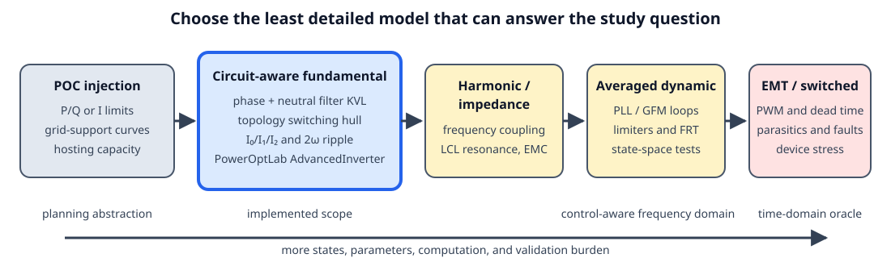
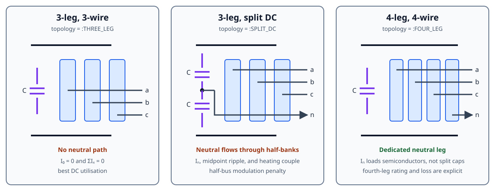

# Inverter-based resources

PowerOptLab has two complementary inverter abstractions:

- a **POC injection model** for studies whose inputs and outputs are contractual
  active/reactive-power or current commands; and
- [`AdvancedInverter`](@ref), a **circuit-aware fundamental-frequency model** for
  studies in which the internal converter voltage, output filter, bridge
  topology, neutral path, or DC-link stress changes the feasible operating set.

Neither is universally “more correct.” The defensible model is the least detailed
one that retains the mechanism relevant to the study question.

## Implemented physical scope

`AdvancedInverter` represents RMS fundamental phasors and derives selected
line-frequency DC quantities from them. It includes:

- an internal converter node behind either a reduced conductor-domain series
  primitive or an explicit LCL network with two primitive arms, a damped
  midpoint capacitor, distinct arm currents, and an optional POC shunt;
- converter-side apparent-power and conductor-current limits;
- 3-leg 3-wire, 3-leg split-DC 4-wire, and 4-leg 4-wire switching-feasibility
  regions;
- Fortescue zero-, positive-, and negative-sequence current limits;
- neutral current, unequal split-link half-bank capacitance, fundamental and
  mean midpoint displacement, bounded balancing charge, 2ω power pulsation,
  DC-bus voltage ripple, and simultaneous frequency-weighted capacitor budgets;
- fixed, current-linear, and current-quadratic converter loss terms, including
  the neutral semiconductor leg for a 4-leg bridge, plus optional weighted
  capacitor-ESR dissipation; and
- a bounded balanced internal voltage for steady-state grid-forming studies.

The topology names are deliberately literal:

| `topology` | AC conductors | Neutral return | DC structure | Distinct limiting mechanism |
| --- | ---: | --- | --- | --- |
| `:THREE_LEG` | 3 | none; `ΣIₓ = 0` | monolithic link | line-to-line switching hull |
| `:SPLIT_DC` | 4 | capacitor midpoint | two possibly unequal half-banks in series | half-bus utilisation, mean/fundamental midpoint motion, individual-bank heating |
| `:FOUR_LEG` | 4 | fourth semiconductor leg | monolithic link | fourth-leg current and loss |

The split-DC model is a **three-leg bridge with a split capacitor link**. It is
not the reconfigurable four-leg-plus-split-link hybrid studied by Deakin,
Heidari, and Deng. That hybrid is a useful future topology, but it should not be
silently folded into either existing category.

## Read this chapter in layers

1. [Scientific foundations](@ref ibr-scientific-foundations) derives the model
   from conductor KVL/KCL, complex power, symmetrical components, capacitor
   energy, and the ideal switching hull.
2. [Verification and benchmark cases](@ref ibr-verification) maps claims to unit,
   regression, paper, and higher-fidelity tests.
3. [IBR references](@ref ibr-references) is the maintained bibliography and
   literature roadmap.
4. The [advanced inverter component reference](@ref AdvancedInverter) documents
   the current API and equations; the [modelling tutorial](@ref
   advanced-inverter-modelling) shows how to choose and parameterise it.

## What this model must not be used to claim

This is not a harmonic power flow, sequence-impedance scan, averaged control
model, or switched EMT model. In particular, `grid_forming=true` is a
steady-state internal-voltage constraint, not evidence of synchronization,
fault ride-through, black start, stable current limiting, or multi-inverter
power sharing. `i_sw` is a reserved RMS allowance, not a PWM ripple calculation.

Those boundaries are intentional. Moving to the right on the fidelity ladder
requires controller transfer functions, switching frequency and modulation,
filter parasitics, semiconductor and capacitor frequency/temperature data, and
a different validation oracle. The chapter records those next layers without
pretending they are already implemented.

## Diagram roadmap

Eight diagrams now cover abstraction level, physical topology, conductor KVL,
the explicit LCL midpoint, sequence-to-hardware pathways, a published 2ω
waveform case, the balanced voltage-utilisation boundary, and asymmetric
split-link charge/current pathways. The last four are generated by
`docs/scripts/generate_ibr_figures.jl` so numerical labels cannot drift from the
derivation.

The next most useful figures are a constraint-dependency map from parameters to
`InverterResult` diagnostics, and a validation pyramid linking exact identities,
published PLECS cases, EMT sweeps, and hardware measurements. A detailed PWM
switching-state diagram should wait until modulation-specific ripple is actually
modelled; drawing it now would imply fidelity the equations do not yet possess.
