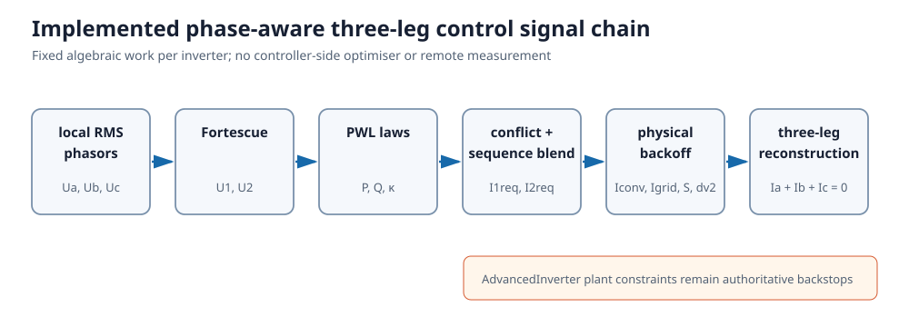
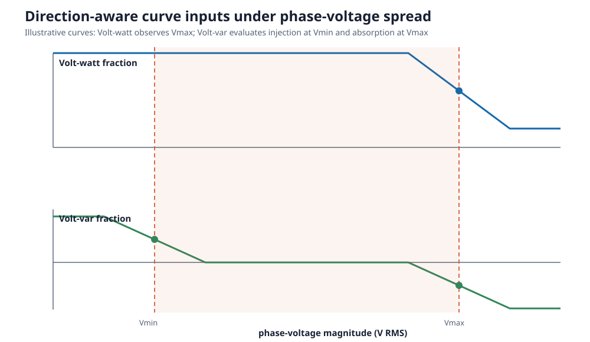
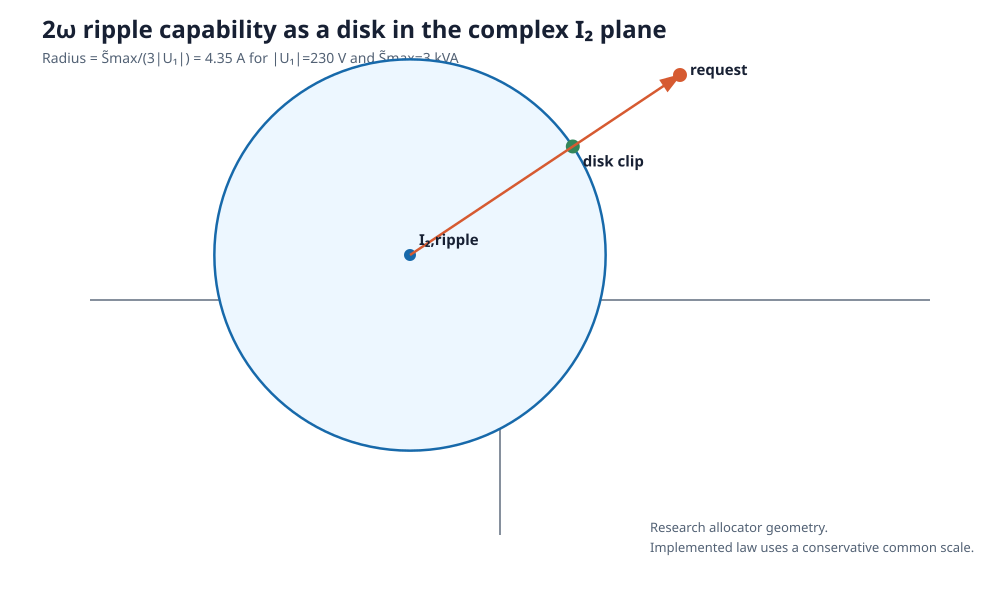

# [Phase-aware local control laws](@id ibr-phase-aware-control-laws)

This note develops and classifies steady-state local Volt-var and Volt-watt extensions for
unbalanced three-phase voltages. The controller may use the local RMS voltage
phasors and their relative angles, but no remote measurements or feeder-wide
optimisation. The immediate target is a three-leg, three-wire converter. A
four-leg converter can use the same framework with the zero-sequence channel
enabled.

The proposal deliberately separates two questions:

1. **What response would the voltage curves prefer?** Existing piecewise-linear
   primitives answer this question.
2. **What current can this converter actually produce?** Topology-aware
   algebraic limiters answer this question without pretending that three
   phase-power commands are independent. A numerical optimiser is useful as an
offline oracle, but is not required in the deployed controller.

The contribution is not a new symmetrical-component controller by itself.
Dual-sequence reference generation is established prior art — dual current
control (Song and Nam), the unbalanced-power algebra and its four real degrees of
freedom (Suh and Lipo), scalar-weighted flexible positive/negative-sequence
reference generation (Rodríguez et al.), and the negative-sequence
virtual-admittance family (Savaghebi et al.); see [IBR
references](@ref ibr-references). The contribution under study is a
fixed-structure algebraic controller that can be stamped into a sparse network
NLP while retaining a separate exact firmware oracle.

!!! warning "Assumptions and validity"
    All phasors are fundamental-frequency RMS quantities at one equilibrium.
    Sequence extraction is ideal and instantaneous. There is no PLL,
    measurement delay, controller bandwidth, ramp rate, hysteresis,
    anti-windup, ride-through state machine, or dynamic-stability model. The
    implemented controller is three-leg and therefore has ``I_0=0``. A solved
    equilibrium establishes neither closed-loop stability nor conformance with
    a standardised time response.

## Normative conventions

| Item | Convention |
| --- | --- |
| Phase order and rotation | ``a,b,c`` and ``\alpha=e^{j2\pi/3}`` |
| Fortescue scaling | factor ``1/3`` in both voltage and current transforms |
| Voltage/current phasors | RMS; current positive from converter into network |
| Complex power | ``S=UI^*``; positive ``P,Q`` are injection |
| Volt-var sign | positive ``Q`` injects vars at low voltage; negative ``Q`` absorbs vars at high voltage |
| ``|\widetilde S|`` | peak Fourier amplitude of 2ω complex power, not RMS |
| Public units | SI; per-unit is internal numerical conditioning only |

## Candidate and implementation status

| Candidate | Status | Role |
| --- | --- | --- |
| average-magnitude scalar droop | implemented | legacy comparator |
| positive-sequence droop with maximum-phase watt guard | implemented | sequence comparator |
| split min/max worst-phase droop | implemented | recommended phase-aware scalar law |
| negative-sequence admittance and ripple blend | implemented | unbalance/ripple study law |
| P/Q watt, var, proportional priority | implemented | positive-sequence capability comparison |
| plant-aware per-leg, apparent-power, and `dv2_max` backoff | implemented | physical protection surrogate |
| virtual-delta droop | future | line-to-line sensor comparator |
| closest-feasible per-phase projection | future offline oracle | upper-performance benchmark |
| power-versus-balance sequence priority | future | service allocation comparison |



## Relationship to standards and reference tools

This software is a research model, not a conformance implementation. The table
maps concepts without claiming clause-level equivalence; a compliance study
must use the licensed, current edition and its prescribed test procedure.

| Source | Public scope relevant here | Mapping and non-coverage |
| --- | --- | --- |
| [IEEE 1547-2018](https://standards.ieee.org/ieee/1547/5915/) and [IEEE 1547.1-2020](https://standards.ieee.org/ieee/1547.1/6039/) | DER reactive capability, voltage/power control, abnormal conditions, and conformance testing | motivates explicit curve bases and P/Q priority; this steady-state model does not reproduce response-time or conformance tests |
| [IEEE 2800-2022](https://standards.ieee.org/ieee/2800/10453/) | interconnection and capability of IBRs on transmission systems, including required behaviour under unbalanced conditions and negative-sequence current injection | the only cited standard that addresses negative-sequence current behaviour normatively; it is a bulk-system document and is not an LV controller specification |
| [AEMO overview of AS/NZS 4777.2](https://www.aemo.com.au/initiatives/major-programs/nem-distributed-energy-resources-der-program/standards-and-connections/as-nzs-4777-2-inverter-requirements-standard) | LV inverter performance, testing, and smart-inverter functions | motivates an Australian comparator; no claim is made against a clause without the current amended licensed text |
| EN 50549-1/-2 and VDE-AR-N 4105 | European LV/MV connection requirements for generating plants | jurisdictional comparator for fixed low-voltage/high-voltage priority; cited for scope only, and their designations/editions are unverified here |
| [IEC 61000-4-30:2025](https://webstore.iec.ch/en/publication/71611) | power-quality measurement methods | ``|U_2|/|U_1|`` is reported from ideal phasors, not a specified measurement window or instrument class |
| [IEC TR 61000-3-13](https://webstore.iec.ch/en/publication/4145) | negative-sequence allocation at MV/HV/EHV | useful planning context, explicitly not an LV controller specification |
| EN 50160 | supply-voltage characteristics | a network-quality benchmark, not a local inverter-control prescription; the designation and edition are listed unverified in [IBR references](@ref ibr-references) and must be pinned before use |
| [OpenDSS `InvControl`](https://opendss.epri.com/Commonproperties.html) | monitored-voltage `AVG`, `MAX`, and `MIN` modes | independent balanced fixed-point oracle; it does not implement this split low/high Volt-var conflict law or negative-sequence droop |

!!! danger "Open novelty check — do this before submission"
    The scalar contribution below is stated against *public* summaries of
    AS/NZS 4777.2 and IEEE 1547-2018, because their normative text is licensed
    and is not reproduced here. Both standards prescribe which voltage a
    multi-phase DER shall observe for Volt-var and Volt-watt, and at least one
    of them may already require an extreme-phase (rather than averaged)
    reference. **Someone must read the current licensed clause in both
    documents.** If extreme-phase monitoring is already normative, the split
    minimum/maximum envelope is prior art and only the conflict rule, its
    continuity argument, and the smooth network surrogate remain as
    contributions. That would not invalidate any result on this page, but it
    would change the claim.

OpenDSS already provides a maximum-monitored-voltage Volt-watt mode, so that
guard is not claimed as novel. Subject to the check above, the specific scalar
contribution is the split minimum/maximum treatment of the two Volt-var
branches, a declared continuous conflict rule, and a matching fixed-structure
smooth network surrogate.

### The measured voltage reference is part of the law

Every phase-magnitude comparator on this page is stated in phase-to-neutral
voltage, but a magnitude only has meaning relative to a reference conductor.
The implemented controller measures the POC voltage referred to the plant's
declared `neutral` terminal; when the composed inverter is three-wire
(`neutral=nothing`, which is also the only form accepted for a native
`THREE_LEG` fleet record) that reference is the network's ground.

The distinction is the local zero-sequence displacement ``U_0``, and it is not
cosmetic:

- ``U_1`` and ``U_2`` are invariant to it, so the positive-sequence Volt-var
  comparator and the negative-sequence droop give identical commands under any
  common-mode offset;
- the minimum, maximum, and mean phase magnitudes are **not** invariant, so the
  worst-phase and average comparators respond to ``U_0``; and
- a three-leg bridge has ``I_0=0`` and therefore cannot act on the very
  component it is reacting to.

This is the same objection raised against averaged references in §"Virtual-delta
line-to-line droop", applied to the recommended law itself. It is a sensor
specification, not a modelling artefact: a product that senses phase-to-neutral
and a product that senses phase-to-ground implement different laws on the same
feeder. Studies using a phase-magnitude comparator should therefore report
``U_0`` alongside ``|U_2|`` — `InverterControlResult.voltage_sequence[1]` — so
the reference-dependent share of each curtailment decision is visible. The
invariance contract is pinned by a common-mode metamorphic test; see
[Verification and benchmark cases](@ref ibr-verification).

## Current behaviour in BMOPFTools

The present implementation is not an averaged three-leg controller:

- `PN_PER_PHASE` is the default Volt-var/Volt-watt reference for `FOUR_LEG` and
  `SINGLE_PHASE` IBRs;
- the `*_AVERAGED` references are explicit alternatives, and the legacy
  `voltage_aggregation="AVERAGE"` field can also request averaging; and
- Volt-var/Volt-watt is currently disabled for `THREE_LEG`, with a warning and
  fallback to static power boxes.

The built-in `THREE_LEG` injection model uses cyclic line-to-line branch
currents. [`AdvancedInverter`](@ref) instead represents physical phase-conductor
currents and imposes ``I_a+I_b+I_c=0``. The latter is the appropriate feasibility
oracle for developing a controller intended for a physical three-leg bridge.

## The unavoidable three-leg constraints

Let ``U_0``, ``U_1``, and ``U_2`` and ``I_0``, ``I_1``, and ``I_2`` be the RMS Fortescue voltage and
current phasors. For a three-leg, three-wire converter,

```math
I_0=0,\qquad I_a+I_b+I_c=0.
```

It therefore has four real fundamental-current degrees of freedom: the complex
positive- and negative-sequence currents. It can affect negative-sequence
voltage, but it cannot inject zero-sequence current or directly correct a
zero-sequence voltage. This is a physical boundary, not a control-design
limitation.

That four-real-degree budget is the organising constraint. Two complex current
references consume it completely; constant active power, constant reactive
power, balanced current, and a prescribed negative-sequence attenuation cannot
all be imposed independently. Every practical law therefore embeds a priority
or accepts a residual. This degree-of-freedom accounting is the standard
unbalanced-converter result rather than a new observation here; see Suh and Lipo
for the derivation, [Nejabatkhah, Li, and
Wu](https://doi.org/10.1109/TPEL.2015.2479601) for the control taxonomy, and the
maintained [IBR references](@ref ibr-references).

Using the sequence convention in `AdvancedInverter`, aggregate mean complex
power and the double-frequency oscillating-power phasor are

```math
S=3(U_1I_1^*+U_2I_2^*),
\qquad
\widetilde S=3(U_1I_2+U_2I_1).
```

These equations expose the principal tradeoff. Negative-sequence current is
the useful actuator for voltage-unbalance attenuation, but it interacts with
positive-sequence voltage to change phase-current peaks and DC-link 2ω power.
A balanced positive-sequence current is not ripple-free under unbalanced
voltage either: with ``I_2=0``, ``\widetilde S=3U_2I_1``.

Every candidate controller must ultimately satisfy all of the following, not
only an aggregate apparent-power circle:

- ``I_0=0`` and each phase-conductor current limit;
- net DC active-power availability, including whether net import is permitted;
- converter-side apparent-power and loss limits;
- internal-voltage/filter KVL and the instantaneous switching hull;
- negative-sequence policy limits; and
- DC-bus 2ω voltage and capacitor RMS-current limits.

The physical plant should use converter-terminal ``U_{int}`` and ``I_{conv}`` for
converter power and DC-link checks. POC powers alone omit filter voltage drop,
loss, and LCL shunt current. PowerOptLab therefore derives total and sequence
powers from solved converter-terminal phasors. The control law may command either
converter-side current or grid-side current, but both converter-leg and
grid-conductor limits remain hard constraints and take precedence over the
requested service.

## Candidate laws

### 1. Worst-phase scalar droop

This is the lowest-risk baseline. Keep a balanced positive-sequence output, but
replace the mean-voltage input by direction-aware envelopes:

- Volt-watt uses the highest monitored phase voltage, so one overvoltage phase
  cannot be hidden by two normal phases;
- the injecting side of Volt-var uses the lowest phase voltage;
- the absorbing side of Volt-var uses the highest phase voltage; and
- if low- and high-voltage requests coexist, a declared priority or deadlock
  rule resolves the conflict rather than allowing their average to select the
  wrong direction.

The recommended first rule is **continuous dominant severity**. Normalise the
positive and negative branch ordinates by their respective branch maxima, form
their signed severity difference ``d``, and blend with
``w=(1+d/\sqrt{d^2+\epsilon_c^2})/2``. The request
``q=wq_\ell+(1-w)q_h`` approaches winner-take-all away from the tie but returns
zero continuously at equal severity. This avoids both `:net` cancellation away
from a tie and the equilibrium/conditioning problems of a discontinuous switch.
The equilibrium half of that argument is a known property of local Volt-var
feedback rather than a claim made here: Farivar, Chen, and Low give existence and
convergence conditions for local voltage control, and Zhu and Liu bound the droop
slope under limited reactive power. Neither result has been applied to this law,
which is why the continuity argument is stated as motivation and not as a proof.
Fixed low-voltage and fixed high-voltage priorities remain useful jurisdictional
comparators, while `:net` is retained as a legacy scientific baseline.



A conservative smooth proxy can use ``|U_1|\pm k|U_2|`` instead of hard minimum and
maximum operators. This law prevents the most harmful averaged decisions and
needs only firmware, but it does not actively compensate voltage unbalance.

### 2. Virtual-delta line-to-line droop

Measure

```math
U_{ab}=U_a-U_b,\quad U_{bc}=U_b-U_c,\quad U_{ca}=U_c-U_a,
```

apply the existing PWL curves to ``|U_{xy}|/\sqrt{3}``, and translate the desired
virtual branch currents into terminal currents with the delta incidence matrix.
The result satisfies ``I_a+I_b+I_c=0`` by construction.

This is attractive when the product already senses line-to-line voltages: it
requires no neutral-voltage sensor and does not react to an unobservable and
uncontrollable zero-sequence voltage. It should be implemented in terminal
current space, or with a minimum-norm branch-current gauge. Treating three
cyclic branch powers as independently rated physical legs would introduce a
nonphysical circulating degree of freedom.

### 3. Closest-feasible per-phase droop

Evaluate the familiar curves independently to obtain preferred phase powers
``s_\phi^0=p_\phi^0+jq_\phi^0``, then convert them to preferred currents,

```math
i_\phi^0=\left(s_\phi^0/u_\phi\right)^*.
```

Do **not** apply those powers directly. Project the preferred current vector
onto the converter feasible set:

```math
\mathop{\mathrm{minimize}}_{i_a,i_b,i_c}
\sum_\phi w_\phi|i_\phi-i_\phi^0|^2
\quad\text{subject to}\quad
i_a+i_b+i_c=0
```

together with current, net-power, switching, and DC-ripple constraints. With
only the KCL equality and equal weights, the projection has the simple closed
form ``i=i^0-\operatorname{mean}(i^0)``. The constrained version is a small local allocator.

This is the most literal generalisation of per-phase Volt-var/Volt-watt. It can
use phase-asymmetric active power, reactive power, and power circulation to
counter unbalance. The realised phase powers will not in general lie exactly on
all three curves; the projection residual is therefore a required diagnostic,
not an error to hide. Because the fully constrained projection is an online
optimisation, this law is better retained initially as a research benchmark and
offline oracle than as the manufacturer-facing implementation. Local controllers
that track the solution of an optimisation problem online are an established
family — see Dall'Anese and Simonetto in [IBR references](@ref ibr-references) —
and this candidate should be positioned inside it rather than as a bespoke
construction.

### 4. Dual-sequence droop

Use the positive-sequence channel for ordinary aggregate voltage/power control
and reserve the negative-sequence channel for unbalance:

```math
I_1^*=F_1(U_1),\qquad
I_2^*=\operatorname{sat}\!\left(-k_2\widehat H_2^{-1}U_2\right),
```

where ``H_2`` is the locally observed negative-sequence voltage sensitivity to
injected current. A fixed virtual admittance is the simplest implementation.
An online perturb-and-observe estimate can learn the useful angle using the same
local voltage/current sensors and measurement history, without communications.

This reference family is established in the dual-sequence control literature
([Nejabatkhah, Li, and Wu](https://doi.org/10.1109/TPEL.2015.2479601)); optimal
attenuation under current and power constraints is treated by
[Guo, Pal, and Jabr](https://doi.org/10.48550/arXiv.2109.10974).

The static negative-sequence closed loop gives a useful sizing check. With the
local Thévenin convention

```math
U_2=E_2+Z_2I_2,\qquad I_2=-\kappa e^{-j\phi_2}U_2,
```

one obtains

```math
\frac{|U_2|}{|E_2|}
=\frac{1}{|1+\kappa Z_2e^{-j\phi_2}|}
=\frac{1}{\sqrt{1+g^2+2g\cos\delta}},
\quad g=\kappa|Z_2|,\quad \delta=\arg Z_2-\phi_2.
```

For angle alignment, halving ``|U_2|`` requires ``g=1`` and hence
``\kappa=1/|Z_2|``. For ``|Z_2|=0.2``–``0.5\ \Omega``, that is
``2``–``5\ \mathrm{A/V}``. The illustrative ``0.08\ \mathrm{A/V}`` example
has only ``g=0.016``–``0.04``, or about 1.6–3.8% attenuation when aligned. It is
chosen to keep the API example lightly actuated, not as a recommended product
setting. Angle mismatch can amplify unbalance when
``g^2+2g\cos\delta<0``. This is a static equilibrium result only; it does not
establish dynamic stability.

The sensitivity angle matters. Pure negative-sequence reactive current is not
generally the best voltage actuator on a resistive LV connection, and an
incorrect high gain can worsen voltage or destabilise a weak-grid controller.
This law therefore needs current priority, gain scheduling, anti-windup, and a
dynamic impedance/stability study beyond the steady-state OPF model.

### 5. Ripple-cancelling negative-sequence current

For a three-wire converter, the unconstrained choice

```math
I_2^{ripple}=-\frac{U_2}{U_1}I_1
```

makes ``\widetilde S=0``. The implemented law does not divide by ``U_1``. It uses
the regularized target

```math
I_2^{ripple}=-\frac{U_2U_1^*}{|U_1|^2+U_{floor}^2}I_1,
\qquad
\widetilde S=3U_2I_1\frac{U_{floor}^2}{|U_1|^2+U_{floor}^2},
```

with ``U_{floor}`` taken from `NegativeSequenceAdmittanceDroop.voltage_floor` —
a *different* declared floor from the `power_voltage_floor` used in the
``P,Q\mapsto I_1`` conversion. The closed-form residual, not an assertion of
exact zero, is the unit-test oracle, and the disk radius quoted below inherits
the same regularization. This is valuable as a reference policy and as one
endpoint of a tradeoff sweep. It is not automatically a voltage-unbalance controller: its
current angle is selected to cancel DC power pulsation and may oppose the angle
needed to attenuate ``U_2``.

A useful research oracle chooses ``I_2`` by minimising

```math
w_v|I_2-I_2^{unbalance}|^2
+w_{dc}|U_1I_2+U_2I_1|^2
+w_i\max_\phi |I_\phi|^2,
```

subject to the exact converter limits. Varying ``w_v/w_{dc}`` produces a transparent
Pareto frontier between voltage unbalance, semiconductor utilisation, and
capacitor stress. This optimisation-based form is not the implemented
manufacturer-facing law. The implemented `ripple_blend` is a fixed algebraic
interpolation between the two endpoints. Related voltage-unbalance/oscillating-
power tradeoffs are discussed by
[Helaly](https://doi.org/10.14416/j.asep.2023.01.003).

### 6. Sequence droop with algebraic limiters (recommended)

The manufacturer-facing controller can avoid a QP or MPC entirely. At each
phasor update:

1. Compute ``U_1`` and ``U_2`` with the fixed Fortescue transform. If the controller
   already receives phasors, this is only a few complex additions and constant
   multiplications.
2. Evaluate the existing Volt-var/Volt-watt PWL curves for the aggregate
   positive-sequence ``P,Q`` request. Retain a maximum-phase-voltage guard for
   Volt-watt so that a single high phase cannot be hidden.
3. Evaluate a new PWL **voltage-unbalance droop** on
   ``\eta=|U_2|/\sqrt{|U_1|^2+U_{floor}^2}``. Its output ``\kappa(\eta)`` is a
   negative-sequence admittance gain.
4. Give that admittance a fixed configured angle relative to ``U_2``,

   ```math
   I_2^v=-\kappa(\eta)e^{-j\phi_2}U_2,
   ```

   where ``\phi_2`` represents the expected local negative-sequence impedance
   angle. A product family can expose a small set of LV/resistive,
   mixed, and MV/inductive presets. Online impedance identification can remain
   an optional later feature. The admittance form goes continuously to zero at
   ``U_2=0``, needs no unit-phasor division, and is especially convenient for a
   smooth network model. A bounded current-magnitude droop can still be obtained
   with the downstream current limiter.
5. Optionally blend toward the ripple-cancelling target using one fixed setting,

   ```math
   I_2^{req}=(1-\lambda)I_2^v+\lambda I_2^{ripple},
   \qquad 0\le\lambda\le1.
   ```

   A single scalar weighting between two sequence-current references is the
   flexible positive/negative-sequence construction of Rodríguez et al.; ``\lambda``
   should be presented as an instance of it, not as a new knob.

6. Apply the ordinary product priority and saturation logic described below.

For fixed ``I_1``, the 2ω power limit is especially cheap to enforce. Since

```math
\widetilde S=3U_1(I_2-I_2^{ripple}),
```

``|\widetilde S|\leq\widetilde S_{max}`` is just a disk in the complex
``I_2`` plane:

```math
|I_2-I_2^{ripple}|\le
\frac{\widetilde S_{max}}{3|U_1|}.
```

Clipping ``I_2^{req}`` to this disk is one magnitude comparison and one scalar
rescaling. No optimisation solver is involved. The current implementation uses
an even simpler conservative common-current scale when `dv2_max` is declared;
the disk clip remains a candidate for a less conservative balance-priority
allocator.



The phase currents are reconstructed directly,

```math
I_a=I_1+I_2,\qquad
I_b=\alpha^2I_1+\alpha I_2,\qquad
I_c=\alpha I_1+\alpha^2I_2.
```

If any phase exceeds its limit, a common scale
``\gamma=\min(1,I_{max}/\max_\phi|I_\phi|)`` is a safe, very cheap fallback. A less
conservative implementation can use the same familiar priority logic as
positive/reactive current limiters: reserve either ``I_1`` or ``I_2``, then find the
largest admissible scale on the other request with a fixed small number of
bisection steps. This is a one-dimensional limiter, not optimisation-based
control.

The reconstructed current can be applied at either side of an output filter.
Converter-current control maps most directly to semiconductor protection and
converter power. Grid-current control maps most directly to network response and
is already familiar in LCL implementations. With an LCL filter the two currents
are unequal, so a grid-current command must also be checked against converter-leg
headroom. The implemented plant-aware allocator represents the non-target LCL
current as a local shunt-current offset and backs off the common command against
both per-leg ratings, converter-terminal apparent power, and a declared
`dv2_max`. It is conservative but fixed-structure and prevents ordinary
protection saturation from becoming an infeasible equality.

Two declared modes are preferable to hidden weights:

- **power priority** preserves the conventional positive-sequence Volt-var/
  Volt-watt request and gives unbalance control the remaining phase-current and
  ripple headroom; and
- **balance priority** reserves a declared negative-sequence current fraction,
  then curtails positive-sequence current if necessary.

These two sequence-priority modes remain future work. The implemented positive-
sequence allocator already offers watt, var, and proportional P/Q priority;
final physical protection may common-scale both sequences. In all modes,
protection retains absolute priority: phase current, DC voltage,
capacitor current, and modulation margin; then net active-power availability;
then the selected power/balance service priority. The deployed code therefore
consists of PWL evaluation, a Fortescue transform, complex arithmetic, and
scalar saturation—the same broad implementation class as conventional droop
plus current limiting.

## Network-scale smooth formulation

Large-network simulation strengthens, rather than weakens, the case for the
sequence law. The deployed controller remains algebraic, so the OPF should stamp
those equations directly. It must not embed one optimisation problem, KKT
system, complementarity system, or integer mode selector per inverter.

### Sequence measurement

The Fortescue transform is affine in rectangular voltage components and adds no
nonlinearity. Represent each required magnitude exactly with an implicit
nonnegative square root,

```math
\nu_2\geq0,\quad \nu_2^2=U_{2,r}^2+U_{2,i}^2,
\qquad
\nu_1\geq0,\quad
\nu_1^2=U_{1,r}^2+U_{1,i}^2+U_{floor}^2,
\qquad
\eta=\frac{\nu_2}{\nu_1}.
```

The implementation divides both sides of each squared equality by a fixed
physical reference magnitude for numerical scaling; this does not change its
feasible set. ``U_{floor}`` makes the denominator strictly positive and is a declared
low-voltage control regularization. It does not round the ``|U_2|`` magnitude. At
exact ``U_2=0``, the implicit norm equality is algebraically exact but locally
degenerate, so balanced initialization and robustness tests are required.

The PWL curve ``\kappa(\eta)`` can then use BMOPFTools' existing smooth-ReLU/
softplus machinery. In rectangular form, multiplication by
``-\kappa e^{-j\phi_2}`` is only two smooth algebraic equalities for ``I_2``. It avoids
angle variables, `atan`, and a normalised ``U_2/|U_2|`` direction.

### Smooth worst-phase guards

Represent the three phase-voltage magnitudes by implicit nonnegative square-root
variables. Replace hard `max` and `min` in the model by pairwise smooth maximum
and minimum operators using a declared SI voltage width. The square roots inside
those selectors are also implicit; epsilon smooths the selector, not a physical
magnitude. Because there are only three arguments, this adds constant work per
device. The firmware may retain exact comparisons; the smoothed OPF law should
be tested against it around every transition.

### Smooth protection behaviour

Hard current, apparent-power, switching, and ripple capability inequalities are
already smooth when written as squared norms. However, stamping an unconstrained
controller equality alongside those inequalities makes a stressed equilibrium
infeasible instead of reproducing the controller's saturation. The saturation
policy must therefore be part of the algebraic controller model.

For the simple common-scale fallback, first form unconstrained sequence commands
``\widehat I_1``, ``\widehat I_2`` and their phase currents. Define exact implicit magnitudes and

```math
M_I=\operatorname{smax}_\epsilon
  (|\widehat I_a|,|\widehat I_b|,|\widehat I_c|),
\qquad
\gamma_I=\operatorname{smin}_\epsilon
  \left(1,\frac{I_{max}}{M_I}\right).
```

Because converter-terminal apparent and oscillating powers are affine in the
command scale for fixed local voltage and filter shunt current, analogous safe
factors can be constructed for their magnitude limits. For example,

```math
\gamma_{dc}=\operatorname{smin}_\epsilon
\left(1,\frac{\widetilde S_{max}}
{|\widehat{\widetilde S}|}\right).
```

Here epsilon belongs only to the smooth min/max operator. It is not added to a
magnitude or denominator. The implementation applies this pattern to converter
and grid per-leg currents, converter-terminal apparent power, and—when
`dv2_max` is configured—the corresponding 2ω power. PWM reserve is subtracted
from each relevant fundamental-current limit before allocation.

Set ``\gamma=\operatorname{smin}(\gamma_I,\gamma_{dc},\ldots)`` and
``(I_1,I_2)=\gamma(\widehat I_1,\widehat I_2)``. A conservative smooth minimum should remain no
larger than either argument. The exact squared-norm capability inequalities stay
in the model as backstops and diagnostics.

Watt/var/proportional priority is applied before this final protection scale.
Power-versus-balance sequence priority can be added later as a smooth radial
clip of only the lower-priority sequence command. Switching-hull, modulation,
and capacitor thermal allocation are not yet inside the controller; their plant
constraints can still make a snapshot infeasible and must be reported. The
common-scale law is the first large-network implementation because it has fixed
structure, no active-set logic, and an obvious firmware counterpart.

### Sparsity and numerical policy

Each controller touches only its own terminal voltage and current variables.
The Fortescue expressions, norms, two PWL evaluations, and limiter add `O(1)`
work per IBR; different devices still couple only through the existing bus KCL.
The Jacobian and Hessian therefore retain the network's block sparsity as device
count grows.

For scalable Ipopt studies:

- work in rectangular coordinates and per unit;
- cache and register sequence magnitudes instead of rebuilding repeated
  expression trees;
- use one documented smoothing scale for curve corners and separate,
  voltage-relative regularisation for complex norms;
- bound droop slopes and gains so that steep controls do not create a badly
  conditioned equilibrium problem;
- keep the model structure fixed when coefficients are parameterised;
- warm-start across time points and use continuation in control gain or
  smoothing when a feeder is difficult; and
- report the exact-versus-smooth controller residual as well as ordinary KCL
  and device-limit residuals.

The additional nonlinearities remain nonconvex, so Ipopt still finds a local
equilibrium/optimum. Large-scale validation should include multiple starts or
continuation for difficult cases and explicit scaling sweeps in both device
count and controller gain.

### Two magnitude representations, and which one to use where

PowerOptLab now contains both standard smoothings of a Euclidean norm, and the
choice between them is empirical rather than aesthetic:

- the **lifted** form introduces ``y\ge0`` with ``(y/y_b)^2=x/y_b^2``. It is
  exact at every feasible point and adds no bias, and it is what the controller
  uses for phase-voltage, sequence-voltage, apparent-power, and phase-current
  magnitudes.
- the **shifted expression** ``\sqrt{x+\epsilon^2}-\epsilon`` adds no variable
  and no constraint, at the cost of a closed-form one-sided bias of at most
  ``\epsilon``. [`AdvancedInverter`](@ref) moved its current-magnitude loss term
  to this form after measuring that the lifted form cost 2–4× the Ipopt
  iterations in per unit and failed outright in raw SI, because it places a
  small per-unit magnitude inside a squared equality whose residual tolerance is
  absolute.

Three consequences are already visible in the controller and should be treated
as open numerical work rather than settled policy:

1. A lifted magnitude of a quantity that is **structurally zero** is formally
   defective. ``(y/y_b)^2=0`` pins ``y=0`` while its gradient vanishes there, so
   LICQ fails at the model's own solution. The capability allocator does exactly
   this for converter-target apparent power and ``\Delta V_{2,max}`` on every
   filter without an explicit LCL midpoint.

   Removing those constraints was tried and **reverted**. It is bit-identical on
   one platform and moves three assertions in the saturated P/Q-priority
   regression to a non-publishable status on another Ipopt/MUMPS build. The
   degenerate constraints are load-bearing as regularizers — the same result
   [`AdvancedInverter`](@ref) found when it removed the `a_loss == 0` current
   epigraph and pushed an unrelated device into `ITERATION_LIMIT`. A formally
   correct local change to this model can therefore cost publishable status, and
   nothing in the model tells you which ones will. This is the clearest single
   argument that the limiter's conditioning has to be addressed as a whole
   rather than call site by call site.
2. The controller's requirement for `per_unit=true` was established with the
   lifted form throughout. It should be re-measured against the shifted form
   before it is treated as an intrinsic property of the coupled controller
   rather than of this representation.
3. `current_epsilon` and `power_epsilon` are absolute SI widths, so they mean
   different things on a 5 kVA and a 500 kVA inverter and are effectively zero
   once divided by a megavolt-ampere base. The plant already declares its
   smoothing relative to each leg's own rating. Making the controller selectors
   rating-relative would give a heterogeneous fleet one common relative bias;
   it is a deliberate open decision, not an oversight.

The starts and scales handed to each lifted magnitude are likewise chosen per
call site and are not yet audited. Their sensitivity is real: changing only the
fallback start of a curve-free policy from 230 V to the network's own 1 pu base
— 6.5 % on the 245 V test fixtures — is enough to move the near-zero-current
``dv2_max`` case from `LOCALLY_SOLVED` to a non-publishable status. A systematic
start/scale audit, normalizing each auxiliary to its own expected magnitude
rather than to a convenient nearby rating, is the next numerical work item.

## DC capacitor implications

For a monolithic link with a DC source that contributes negligibly at 2ω, the
small-ripple relation already implemented by `AdvancedInverter` gives

```math
|D|=\frac{|\widetilde S|}{2\omega C_{dc}V_{dc}},\qquad
C_{dc,min}=\frac{|\widetilde S|}{2\omega V_{dc}\Delta V_{2,max}},
```

where ``|D|`` and ``\Delta V_{2,max}`` are peak sinusoidal amplitudes. The associated
capacitor-current RMS component is

```math
I_{2\omega,rms}=\frac{|\widetilde S|}{\sqrt2 V_{dc}}.
```

Consequently:

- a negative-sequence voltage controller can require a larger capacitor even
  though a three-leg converter carries no neutral current;
- a ripple-aware negative-sequence angle can reduce the required 2ω capacitance
  and RMS-current rating, at the cost of less voltage-unbalance attenuation or
  more phase current;
- capacitance and ripple-current rating are separate design constraints;
- the calculation must be combined with switching ripple, ESR versus frequency,
  DC-source impedance, hold-up energy, lifetime, and transient-control needs;
  and
- a finite-bandwidth DC source or DC/DC stage can share 2ω current, so the
  open-source formula is a conservative topology-specific limit, not a universal
  sizing rule.

For a four-leg converter, zero-sequence current flows in the fourth leg and does
not pass through a monolithic DC capacitor as fundamental neutral current. For a
split-link three-leg converter it does pass through the half-banks, creates
midpoint motion, and shares their thermal budget with 2ω and switching current.
Those are materially different capacitor-sizing problems.

## Bill-of-materials consequences

The recommended three-leg laws need no fourth leg, neutral conductor, split DC
link, or extra magnetic component. They need:

- positive/negative-sequence extraction in firmware, normally using the DSP and
  PLL-class processing already present;
- the existing phase-current and DC-voltage feedback; and
- either three phase-to-neutral voltage phasors or a line-to-line-only mode.

The line-to-line mode has the strongest no-new-sensor case. If phase-to-neutral
voltage is not already measured, adding a neutral-referenced sensing channel can
be a real BOM, isolation, and certification change. It still does not give a
three-leg bridge authority over zero-sequence voltage.

Larger capacitance is not intrinsically required by phase-aware control. It is
required only when the chosen negative-sequence policy leaves more ``|\widetilde S|``
than the existing link and ripple specification can tolerate. The algebraic
ripple backoff can derate the complete request; a future disk limiter can
redirect negative-sequence support before hardware limits are crossed. A
separate scalar thermal limiter can turn
`i_cap_max` into the corresponding allowable ``\widetilde S_{max}`` after reserving the
measured or modelled switching-current component.

## Development roadmap

The single maintained roadmap and completion status are in
[Inverter-control study methodology](@ref ibr-control-study-methodology). Fleet
construction, matched-case execution, and hardware sweeps are in place. The next
milestones are the exact-law fixed-point oracle, the magnitude start/scale audit,
and the licensed-clause novelty check; virtual-delta, a closest-feasible offline
oracle, and sequence-service priority remain comparison laws after those.

The first implementation should not simply enable the existing four-leg
per-phase equalities for `THREE_LEG`. That would confuse preferred curve values
with independently realisable phase powers and would bypass the topology, DC,
and modulation constraints that motivate this work.
